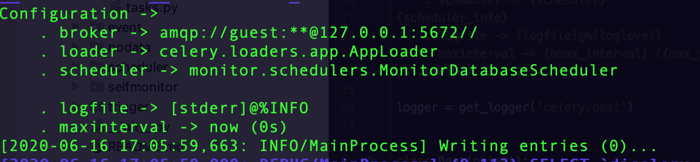

## celery beat


###主要模型：

- Scheduler： 任务调度类

- Entry：定时任务类
- Service：scheduler管理服务（beat service）
- Beat: beat 命令entry


启动方式：

> ```shell
> $ celery -A proj beat -l info --scheduler django_celery_beat.schedulers:DatabaseScheduler
> 
> $ celery -A proj beat -l info --scheduler redbeat.RedBeatScheduler
> ```


命令执行时加载Beat类，并实例化启动

```python
def run(self, detach=False, logfile=None, pidfile=None, uid=None,
        gid=None, umask=None, working_directory=None, **kwargs):
    if not detach:
        maybe_drop_privileges(uid=uid, gid=gid)
    workdir = working_directory
    kwargs.pop('app', None)
    beat = partial(self.app.Beat,
                   logfile=logfile, pidfile=pidfile, **kwargs)

    if detach:
        with detached(logfile, pidfile, uid, gid, umask, workdir):
            return beat().run()
    else:
        return beat().run()
        
# app.Beat
    @cached_property
    def Beat(self, **kwargs):
        return self.subclass_with_self('celery.apps.beat:Beat')
```


Beat的run方法

```python
def run(self):
    print(str(self.colored.cyan(
        'celery beat v{0} is starting.'.format(VERSION_BANNER))))
    self.init_loader()
    self.set_process_title()
    self.start_scheduler()
```

```python
def start_scheduler(self):
    c = self.colored
    if self.pidfile:
        platforms.create_pidlock(self.pidfile)
    beat = self.Service(app=self.app,
                        max_interval=self.max_interval,
                        scheduler_cls=self.scheduler_cls,
                        schedule_filename=self.schedule)

    print(str(c.blue('__    ', c.magenta('-'),
              c.blue('    ... __   '), c.magenta('-'),
              c.blue('        _\n'),
              c.reset(self.startup_info(beat)))))
    self.setup_logging()
    if self.socket_timeout:
        logger.debug('Setting default socket timeout to %r',
                     self.socket_timeout)
        socket.setdefaulttimeout(self.socket_timeout)
    try:
        self.install_sync_handler(beat)
        # 这里开始调用service的start方法
        beat.start()
    except Exception as exc:
        logger.critical('beat raised exception %s: %r',
                        exc.__class__, exc,
                        exc_info=True)
```
打印出这玩意的时候，表示马上要加载scheduler类型了。



Service的start方法（run Loop）

```python
def start(self, embedded_process=False, drift=-0.010):
    info('beat: Starting...')
    debug('beat: Ticking with max interval->%s',
          humanize_seconds(self.scheduler.max_interval))

    signals.beat_init.send(sender=self)
    if embedded_process:
        signals.beat_embedded_init.send(sender=self)
        platforms.set_process_title('celery beat')

    try:
      # Loop
        while not self._is_shutdown.is_set():
          # scheduler的核心method：tick
            interval = self.scheduler.tick()
            interval = interval + drift if interval else interval
            if interval and interval > 0:
                debug('beat: Waking up %s.',
                      humanize_seconds(interval, prefix='in '))
                time.sleep(interval)
                if self.scheduler.should_sync():
                    self.scheduler._do_sync()
    except (KeyboardInterrupt, SystemExit):
        self._is_shutdown.set()
    finally:
        self.sync()
```

这里可以看到scheduler的核心method

1. tick： 将到时间的定时任务发布并返会下个次即将到达的任务的时间。

```python
def tick(self):
    """Run a tick, that is one iteration of the scheduler.

    Executes all due tasks.

    """
    remaining_times = []
    try:
        for entry in values(self.schedule):
            next_time_to_run = self.maybe_due(entry, self.publisher)
            if next_time_to_run:
                remaining_times.append(next_time_to_run)
    except RuntimeError:
        pass

    return min(remaining_times + [self.max_interval])
```

scheduler对象的属性/方法：

max_interval： loop的sleep最大时间。

**schedule： 存放任务（entry对象）的字典**

**maybe_due**： 接受一个entry对象，并决定是否将该entry的task发布

```python
def maybe_due(self, entry, publisher=None):
    is_due, next_time_to_run = entry.is_due()

    # 判定是否需要发布
    if is_due:
        info('Scheduler: Sending due task %s (%s)', entry.name, entry.task)
        try:
          # 熟悉的代码：发布celery任务? 封装了一层
            result = self.apply_async(entry, publisher=publisher)
        except Exception as exc:
            error('Message Error: %s\n%s',
                  exc, traceback.format_stack(), exc_info=True)
        else:
            debug('%s sent. id->%s', entry.task, result.id)
    # 返回下次执行检查的时间
    return next_time_to_run
```

Entry method：is_due

```python
# Entry
def is_due(self):
    """See :meth:`~celery.schedule.schedule.is_due`."""
    return self.schedule.is_due(self.last_run_at)
```

```python
# Scheduler
def is_due(self, last_run_at):
    """Returns tuple of two items `(is_due, next_time_to_check)`,
    where next time to check is in seconds.

    e.g.

    * `(True, 20)`, means the task should be run now, and the next
        time to check is in 20 seconds.

    * `(False, 12.3)`, means the task is not due, but that the scheduler
      should check again in 12.3 seconds.

    The next time to check is used to save energy/cpu cycles,
    it does not need to be accurate but will influence the precision
    of your schedule.  You must also keep in mind
    the value of :setting:`CELERYBEAT_MAX_LOOP_INTERVAL`,
    which decides the maximum number of seconds the scheduler can
    sleep between re-checking the periodic task intervals.  So if you
    have a task that changes schedule at runtime then your next_run_at
    check will decide how long it will take before a change to the
    schedule takes effect.  The max loop interval takes precendence
    over the next check at value returned.

    .. admonition:: Scheduler max interval variance

        The default max loop interval may vary for different schedulers.
        For the default scheduler the value is 5 minutes, but for e.g.
        the django-celery database scheduler the value is 5 seconds.

    """
```

```python
def apply_async(self, entry, publisher=None, **kwargs):
    # Update timestamps and run counts before we actually execute,
    # so we have that done if an exception is raised (doesn't schedule
    # forever.)
    # 重点关注这里
    entry = self.reserve(entry)
    task = self.app.tasks.get(entry.task)

    try:
      # 这才是真正的发布任务
        if task:
            result = task.apply_async(entry.args, entry.kwargs,
                                      publisher=publisher,
                                      **entry.options)
        else:
            result = self.send_task(entry.task, entry.args, entry.kwargs,
                                    publisher=publisher,
                                    **entry.options)
    except Exception as exc:
        reraise(SchedulingError, SchedulingError(
            "Couldn't apply scheduled task {0.name}: {exc}".format(
                entry, exc=exc)), sys.exc_info()[2])
    finally:
        self._tasks_since_sync += 1
        if self.should_sync():
            self._do_sync()
    return result
```

```python
def reserve(self, entry):
  # entry 需要实现 __next__方法，产生下一个任务的entry
    new_entry = self.schedule[entry.name] = next(entry)
    return new_entry
```


以上就是beat的核心逻辑。

