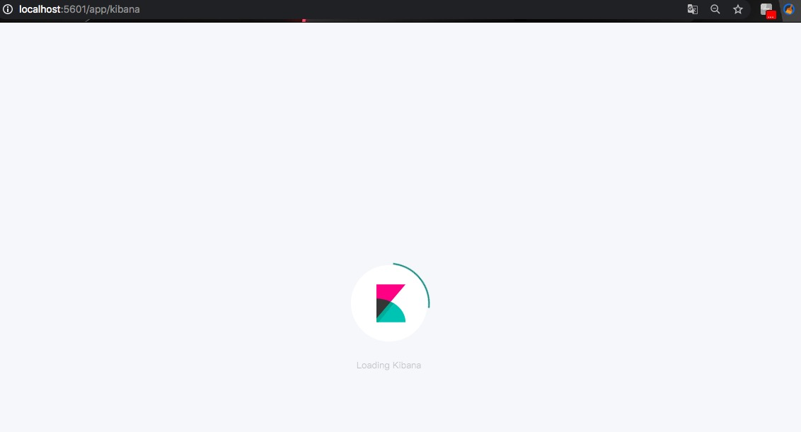

#  ElasticSearch

##  ES概述

1. ES是一个基于Lucene的搜索服务器。它提供了一个分布式多用户能力的全文搜索引擎，基于RESTfulweb接口。ES是用Java开发的，并作为Apache许可条款下的开放源码发布，是当前流行的企业级搜索引擎。设计用于云计算中，能够达到实时搜索，稳定，可靠，快速，安装使用方便。构建在全文检索开源软件Lucene之上的ES，不仅能对海量规模的数据完成分布式索引与检索，还能提供数据聚合分析。据国际权威的数据库产品评测机构DBEngines的统计，在2016年1月，ES已超过Solr等，成为排名第一的搜索引擎类应用。

   

   概括：基于Restful标准的高扩展高可用的实时数据分析的全文搜索工具。

2. ES的基本概念

   a. Index：MySQL数据库中的Database　

   b. Type：类似于MySQL数据库中的table表，ES中可以在Index中建立Type（table），通过Mapping进行映射。
   c. Document：由于ES存储的数据是文档型的，一条数据对应一篇文档即相当于MySQL数据库中的一行数据row，一个文档中可以有多个字段也就是MySQL数据库一行可以有多列。
   d. Field：ES中一个文档中对应的多个列与MySQL数据库中每一列对应。
   e. Mapping：可以理解为MySQL中对应的Schema，ES中的Mapping增加了动态识别功能。

   f. Indexed：就是名义上的建立索引。mysql中一般会对经常使用的列增加相应的索引用于提高查询速度，而在ES中默认都是会加上索引的。（除非你特殊制定不建立索引只是进行存储用于展示)。

   g. Query DSL：类似于MySQL的sql语句，在ES中使用的是Json格式的查询语句，专业术语就叫：QueryDSL。

   h. GET/PUT/POST/DELETE：分别类似与MySQL中的SELECT/INSERT/UPDATE/DELETE。

3. ES架构

   

   a. Gateway：ES用来存储索引文件的一个文件系统且它支持很多类型，例如：本地磁盘、共享存储、分布式存储。它的主要职责是用来对数据进行长持久化以及整个集群重启之后可以通过Gateway重新恢复数据。

   b.  Distributed Lucene Directory：是一个lucene的分布式框架，lucene是做检索的，是一个单机的搜索引擎，像这种eES分布式搜索引擎系统，虽然底层用lucene，但是需要在每个节点上都运行lucene进行相应的索引、查询以及更新，所以需要做成一个分布式的运行框架来满足业务的需要。

   c.  四大模块组件：

   ​	i. Index Module：索引模块，就是对数据建立索引也就是通常所说的建立一些倒排索引等;

   ​	ii. Search Module：搜索模块，就是对数据进行查询搜索；

   ​	iii. Mapping：数据映射与解析模块，就是你的数据的每个字段可以根据你建立的表结构通过	Mapping进行映射解析，如果你没有建立表结构，ES就会根据你的数据类型推测你的数据结构之后自己生成一个Mapping，然后都是根据这个Mapping进行解析你的数据；

   ​	iv. River：ES的一个数据源，是其它存储方式同步数据到ES的一种方式。

   d. Discovery、Script：ES是一个集群包含很多节点，很多节点需要互相发现对方，然后组成一个集群包括选主从，这些ES都是用的Discovery模块，默认使用的是 Zen，也可是使用EC2；ES查询还可以支撑多种Script即脚本语言，包括Mvel、Js、Python等等。

   e. Transport协议层：ES的通讯接口，支持的也比较多：Thrift、Memcached以及Http，默认的是Http，JMX就是Java的一个远程监控管理框架，因为是通过Java实现的。

   f . RESTful接口层：ES暴露给我们的访问接口，官方推荐的方案就是这种Restful接口，直接发送Http请求，方便后续使用Nginx做代理、分发包括可能后续会做权限的管理，通过Http很容易做这方面的管理。

4. RESTfull API

   一种软件架构风格、设计风格，而不是标准，只是提供了一组设计原则和约束条件。它主要用于客户端和服务器交互类的软件。基于这个风格设计的软件可以更简洁，更有层次，更易于实现缓存等机制。在目前主流的三种Web服务交互方案中，REST相比于SOAP（Simple Object Access protocol，简单对象访问协议）以及XML-RPC更加简单明了。它使用典型的HTTP方法，诸如GET、POST、DELETE、PUT来实现资源的获取，添加，修改，删除等操作。

5. CRUL命令
   以命令的方式执行HTTP协议的请求 GET/POST/PUT/DELETE

   ```
   curl www.baidu.com
   
   curl -o tt.html www.baidu.com
   
   显示响应的头信息
   
   curl -i www.baidu.com
   
   显示一次HTTP请求的通信过程
   
   curl -v www.baidu.com
   
   执行GET/POST/PUT/DELETE操作
   
   curl -X GET/POST/PUT/DELETE url
   ```

##  ES及插件安装

1. 配置JDK环境，配置Java环境变量
   
   

2. 安装ElasticSearch7.7.1
   下载地址：https://www.elastic.co/cn/downloads/elasticsearch
   进行解压，然后并进入文件目录并启动
   
   
   然后访问：http://127.0.0.1:9200/，出现如下内容，则代表安装成功：			
   

   此时连接ES会存在跨域问题，请在config/elasticsearch.yml中添加如下配置：

   ```
   http.cors.enabled: true
   http.cors.allow-origin: "*"
   ```

   并重启ES，然后就可以连接上，此时我们再删除多余的索引，以便后面的学习
   

3. 安装ES-head插件，可以直观的看到ES运行和数据存储的情况。  
   进入到ES安装目录，下载ES-head插件
   git clone git://github.com/mobz/elasticsearch-head.git
   进入ES-head目录，然后下载相关依赖：npm install
   
   然后启动这个插件：npm run start
   			
   访问：http://localhost:9100/，看到如下信息则表示安装成功
   

4. 安装Kibana（推荐），Kibana是ES的一个配套工具，让用户在网页中可以直接与ES进行交互。
   使用brew来下载安装Kibana：brew insatll Kibana
   启动：kibana ，然后访问：http://localhost:5601/，显示如下内容则安装成功
   

5. 配置中文分词器，经过中文分词器，文档会根据分词规则，将文档进行分词
   进入https://github.com/medcl/elasticsearch-analysis-ik/下载分词器压缩包，版本必须和ES一致，解压缩到ES根目录下plugins目录下，重启ES，然后按照GitHub上的教程走一遍熟悉分词器的使用。

   1. create a index

   ```json
   curl -XPUT http://localhost:9200/index
   ```

   2. create a mapping

   ```json
   curl -XPOST http://localhost:9200/index/_mapping -H 'Content-Type:application/json' -d'
   {
           "properties": {
               "content": {
                   "type": "text",
                   "analyzer": "ik_max_word",
                   "search_analyzer": "ik_smart"
               }
           }
   
   }'
   ```

   3. index some docs

   ```json
   curl -XPOST http://localhost:9200/index/_create/1 -H 'Content-Type:application/json' -d'
   {"content":"美国留给伊拉克的是个烂摊子吗"}
   '
   
   curl -XPOST http://localhost:9200/index/_create/2 -H 'Content-Type:application/json' -d'
   {"content":"公安部：各地校车将享最高路权"}
   '
   
   curl -XPOST http://localhost:9200/index/_create/3 -H 'Content-Type:application/json' -d'
   {"content":"中韩渔警冲突调查：韩警平均每天扣1艘中国渔船"}
   '
   
   curl -XPOST http://localhost:9200/index/_create/4 -H 'Content-Type:application/json' -d'
   {"content":"中国驻洛杉矶领事馆遭亚裔男子枪击 嫌犯已自首"}
   '
   ```

   4. query with highlighting

   ```json
   curl -XPOST http://localhost:9200/index/_search  -H 'Content-Type:application/json' -d'
   {
       "query" : { "match" : { "content" : "中国" }},
       "highlight" : {
           "pre_tags" : ["<tag1>", "<tag2>"],
           "post_tags" : ["</tag1>", "</tag2>"],
           "fields" : {
               "content" : {}
           }
       }
   }
   '
   ```

   Result

   ```json
   {
       "took": 14,
       "timed_out": false,
       "_shards": {
           "total": 5,
           "successful": 5,
           "failed": 0
       },
       "hits": {
           "total": 2,
           "max_score": 2,
           "hits": [
               {
                   "_index": "index",
                   "_type": "fulltext",
                   "_id": "4",
                   "_score": 2,
                   "_source": {
                       "content": "中国驻洛杉矶领事馆遭亚裔男子枪击 嫌犯已自首"
                   },
                   "highlight": {
                       "content": [
                           "<tag1>中国</tag1>驻洛杉矶领事馆遭亚裔男子枪击 嫌犯已自首 "
                       ]
                   }
               },
               {
                   "_index": "index",
                   "_type": "fulltext",
                   "_id": "3",
                   "_score": 2,
                   "_source": {
                       "content": "中韩渔警冲突调查：韩警平均每天扣1艘中国渔船"
                   },
                   "highlight": {
                       "content": [
                           "均每天扣1艘<tag1>中国</tag1>渔船 "
                       ]
                   }
               }
           ]
       }
   }
   ```

   

##  ES使用

1. 首先进入到Kibana -> Dev tools 下，执行下边的代码：

   ```json
   #number_of_shards 分片数量
   #number_of_replicas 副本数量
   
   PUT index
   {
    "settings":{
      "index":{
        "number_of_shards":5,
        "number_of_replicas":1    
      }
    }
   }
   ```

2. 这样就成功创建了索引，进入http://localhost:9100/ 查看刚才建立的索引
   

3. 对ES的CRUD操作

   ```json
   #number_of_shards 分片数量
   #number_of_replicas 副本数量
   
   # put 增加一个索引
   PUT demo
   {
    "settings":{
      "index":{
        "number_of_shards":5,
        "number_of_replicas":1
        
      }
    }
   }
   
   # 查看demo索引配置
   GET demo/_settings
   # 查看所有索引
   GET _all/_settings
   
   
   # 使用PUT在索引下添加文档、修改文档
   PUT demo/job/1
   {
   "title":"python分布式爬虫开发",
   "salary_min":15000,
   "city":"广东",
   "company":{
   "name":"IEG",
   "company_addr":"科兴"
   },
   "publish_date":"2020-6-13",
   "comments":15
   }
   
   
   PUT demo/job/2
   {
   "title":"java分布式开发",
   "salary_min":15000,
   "city":"广东",
   "company":{
   "name":"WX",
   "company_addr":"腾大"
   },
   "publish_date":"2020-6-13",
   "comments":15
   }
   
   # 使用PUT可以指定id，如果不想指定id可以使用POST 
   POST demo/job/
   {
   "title":"java分布式开发",
   "salary_min":15000,
   "city":"广东",
   "company":{
   "name":"WX",
   "company_addr":"腾大"
   },
   "publish_date":"2020-6-13",
   "comments":15
   }
   
   # 通过id查找
   GET demo/job/1
   # 查找某个字段
   GET demo/job/1?_source=title
   
   # POST使用直接修改的方式来更新数据
   # PUT使用覆盖的方式来更新数据
   POST demo/job/1/_update
   {
     "doc": {
       "city": "深圳"
     }
   }
   
   # 删除某个文档
   DELETE demo/job/1
   
   # 删除索引
   DELETE demo
   
   ```

   可以在ES-head中对比查看
   

4. ES的批量请求

   ```json
   # 批量获取数据
   GET /_mget
   {
       "docs":[
          {
              "_index": "demo",
              "_type": "job",
              "_id": 1
          },
          {
              "_index": "demo",
              "_type": "job",
              "_id": 2,
              "_source":["title", "city"]  # 获取数据中的某个字段
          }
        ]
   }
   # 当获取同一索引，同一job下
   GET /demo/job/_mget
   {
       "docs":[
          {
              "_id": 1
          },
          {
              "_id": 2,
              "_source":["title", "city"]
          }
        ]
   }
   
   # 直接获取
   GET /demo/job/_mget
   {
     "ids": ["1", "2"]
   }
   ```

5. 使用Bulk API实现批量操作

   bulk的格式：

   {action:{metadata}}

   {requstbody}

   action:(行为)

   1. create：文档不存在时创建
   2. update:更新文档
   3. index:创建新文档或替换已有文档
   4. delete:删除一个文档

   metadata：_index,_type,_id

   create 和index的区别

   *如果数据存在，使用create操作失败，会提示文档已经存在，使用index则可以成功执行。*

   ```json
   # 示例：
   
   {"delete":{"_index":"lib","_type":"user","_id":"1"}}
   
   # 批量添加:
   
   POST /lib2/books/_bulk
   
   {"index":{"_id":1}}
   
   {"title":"Java","price":55}
   
   {"index":{"_id":2}}
   
   {"title":"Html5","price":45}
   
   {"index":{"_id":3}}
   
   {"title":"Php","price":35}
   
   {"index":{"_id":4}}
   
   {"title":"Python","price":50}
   
   # 批量获取:
   
   GET /lib2/books/_mget
   {
   
   "ids": ["1","2","3","4"]
   }
   
   # 删除：没有请求体
   
   
   POST /lib2/books/_bulk
   
   {"delete":{"_index":"lib2","_type":"books","_id":4}}
   
   {"create":{"_index":"tt","_type":"ttt","_id":"100"}}
   
   {"name":"lisi"}
   
   {"index":{"_index":"tt","_type":"ttt"}}
   
   {"name":"zhaosi"}
   
   {"update":{"_index":"lib2","_type":"books","_id":"4"}}
   
   {"doc":{"price":58}}
   
   ```

   　　bulk会把将要处理的数据载入内存中，所以数据量是有限制的，最佳的数据量不是一个确定的数值，它取决于你的硬件，你的文档大小以及复杂性，你的索引以及搜索的负载。


##  ES原理

###  1. 版本控制

ElasticSearch采用了乐观锁来保证数据的一致性，也就是说，当用户对document进行操作时，并不需要对该document作加锁和解锁的操作，只需要指定要操作的版本即可。当版本号一致时，ElasticSearch会允许该操作顺利执行，而当版本号存在冲突时，ElasticSearch会提示冲突并抛出异常（VersionConflictEngineException异常）。

ElasticSearch的版本号的取值范围为1到2^63-1。

内部版本控制：使用的是_version


外部版本控制：elasticsearch在处理外部版本号时会与对内部版本号的处理有些不同。它不再是检查_version是否与请求中指定的数值_相同_,而是检查当前的_version是否比指定的数值小。如果请求成功，那么外部的版本号就会被存储到文档中的_version中。

###  2. Mapping

ES的Mapping非常类似于静态语言中的数据类型：声明一个变量为int类型的变量， 以后这个变量都只能存储int类型的数据。同样的， 一个number类型的Mapping字段只能存储number类型的数据。

同语言的数据类型相比，Mapping还有一些其他的含义，Mapping不仅告诉ES一个field中是什么类型的值， 它还告诉ES如何索引数据以及数据是否能被搜索到。

简单来说，Mapping就是Index的type的元数据，每个type都有一个自己的Mapping，决定了数据类型，建立倒排索引的行为，还有进行搜索的行为。

```json
PUT /myindex/article/1 
{ 
  "post_date": "2020-06-13", 
  "title": "Java", 
  "content": "java is the best language", 
  "author_id": 119
}

PUT /myindex/article/2
{ 
  "post_date": "2020-06-14", 
  "title": "html", 
  "content": "I like html", 
  "author_id": 120
}

PUT /myindex/article/3
{ 
  "post_date": "2020-06-15", 
  "title": "es", 
  "content": "Es is distributed document store", 
  "author_id": 110
}
# 查看当前索引下mapping
GET myindex/_mapping

# 精准匹配查找文档
GET /myindex/article/_search?q=post_date:2020-06-13


GET /myindex/article/_search?q=html

```

Mapping的核心数据类型：

```
true or false	-->	boolean
123		-->	long
123.45		-->	double
2017-01-01	-->	date
"hello world"	-->	string/text
```

ps：我们可以在创建Index时手动建立Mapping，或者新增field mapping，但是不能update field mapping。

###  3. 倒排索引(inverted index)

倒排索引是区别于正排索引来说的，正排索引是从文档角度看其中的单词，表示每个文档都含有哪些单词、词频、位置。倒排索引则是从单词角度看文档，表示每个单词分别在那些文档中出现、词频、位置。

简单记为：

正排索引：文档 ---> 单词

倒排索引：单词 ---> 文档

创建倒排索引，主要分为以下几步：

1. 创建文档列表
   
2. 创建倒排索引列表，然后对数据进行分词，得到词条并编号
   

3. 搜索过程：当用户输入任意的词条时，首先对用户输入的数据进行分词，得到用户要搜索的所有词条，然后拿着这些词条去匹配，找到这些词条就可以找到包含词条的所有文档的编号，然后再根据编号去文档列表中找文档。