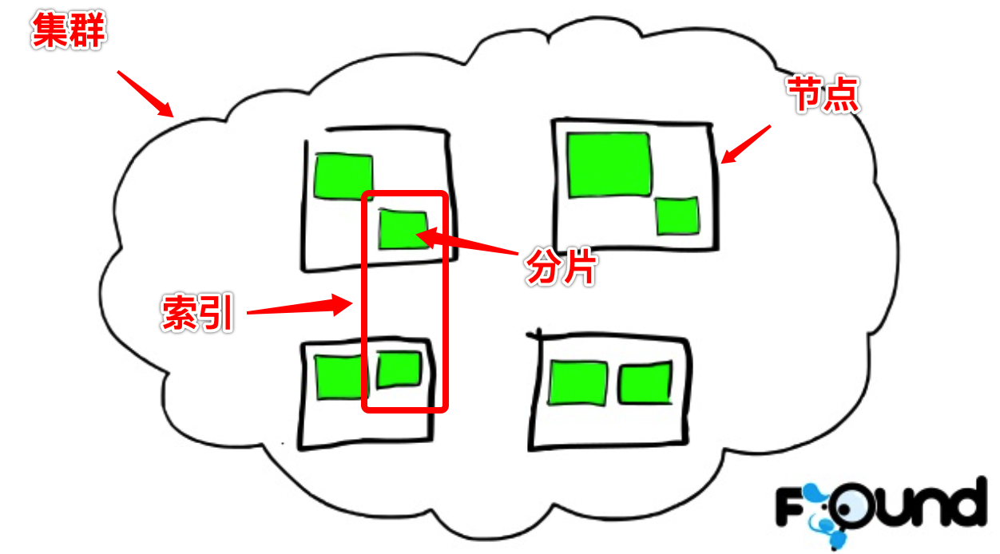
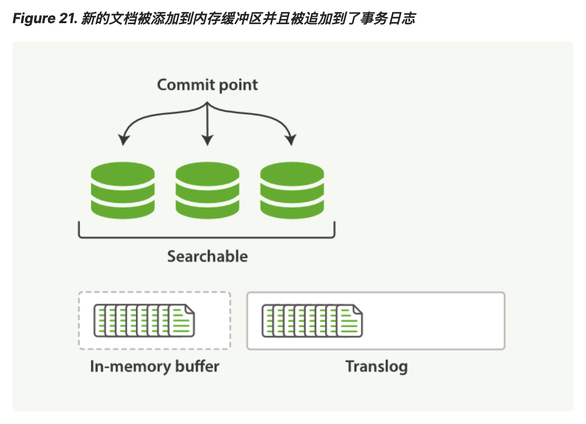
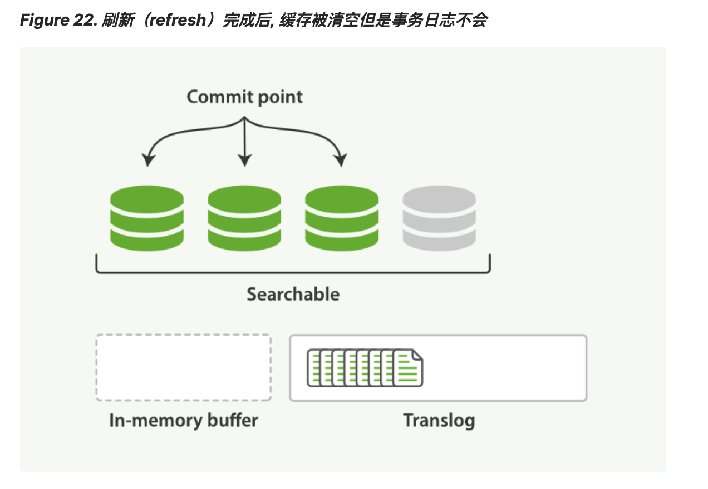

## 1. 数据组织方式

### 1.1 逻辑结构

与MySQL概念对比

| Elasticsearch | MySQL    |
| ------------- | -------- |
| index         | database |
| doc_type      | table    |
| document      | row      |
| field         | column   |
| mapping       | schema   |

- MySQL 中的数据库 (database)，对应 ES 中的索引(index)
- MySQL 中一个数据库表 (table)，对应一个索引下的类型 (doc_type)。需要注意的是，对于关系型数据库而言，table与table之间是完全独立的，不同table的schema是完全隔离的，而Elasticsearch中的doc_type则不是。同一个index下不同doc_type中的字段在底层是合并在一起存储的，意味着假设两个doc_type中都有一个叫name的字段，那么这两个字段的mapping必须一样。基于这个原因，Elasticsearch官方从6.0开始淡化doc_type的概念，推荐一个index只拥有一个doc_type，并计划在8.x完全废弃doc_type。因此，在当前的index设计中，最好能遵循这个规则
- MySQL 中一个数据库表 (Table) 下的数据由多行 (row) 多列 (column)组成，对应一个类型 (doc_type) 由多个文档 (Document) 和多字段 (field) 组成。
- MySQL 中定义表结构、设定字段类型等价于 ES 中的 Mapping。例如，在一个关系型数据库里面，Schema 定义了表、每个表的字段，还有表和字段之间的关系。与之对应的，在 ES 中，Mapping 定义索引下的Type的字段处理规则，即索引如何建立、索引类型、是否保存原始索引 JSON 文档、是否压缩原始 JSON 文档、是否需要分词处理、如何进行分词处理等

### 1.2 物理结构

基本概念

#### 1.2.1 集群 (Cluster)

一个分布式系统，是由多个节点各司其职、相互协作完成整体服务的。从架构上可以分为有中心管理节点和无中心管理节点两种。Elasticsearch属于前者。中心管理节点负责维护整个系统的状态和元信息。

#### 1.2.2 节点 (Node)

**主节点 (master node)**

主资格节点的主要职责是和集群操作相关的内容，如**创建或删除索引，跟踪哪些节点是群集的一部分，并决定哪些分片分配给相关的节点**。

**数据节点(data node)**

数据节点主要是存储索引数据的节点，**主要对文档进行增删改查操作，聚合操作**等。数据节点对cpu，内存，io要求较高， 在优化的时候需要监控数据节点的状态，当资源不够的时候，需要在集群中添加新的节点。

为了确保一个集群的稳定，分离主节点和数据节点是一个比较好的选择。 

#### 1.2.3 分片 (Shard)

Elasticsearch是一个分布式系统，其数据会分散存储到不同的节点上。为了实现这一点，需要将每个index中的数据划分到不同的块中，然后将这些数据块分配到不同的节点上存储。这里的数据块，就是**shard**，每个分片是一个Lucene索引。

**主分片(primary shard)**: 每个文档都存储在一个分片中，当你存储一个文档时，系统会先存储在主分片中，然后复制到不同的副本中。

**副本分片(replica shard)**: 每一个分片有0或多个副本，它是主分片的复制。

**route**: 插入一条数据时，Elasticsearch会根据指定的key来计算应该落到哪个shard上。默认key是自动分配的id，也可以自定义。**数据到shard的映射，称为route**

**shard allocate**: 知道数据应该存在哪个 shard 的情况下，还要知道这个shard分配到哪个节点下。**shard到节点的映射，称为 shard allocate**

#### 1.2.4 结构示意图

Shard 内部结构。**segment** 是Elasticsearch的最小数据单元

## 2. 数据写入过程

当有数据写入请求时，请求会先到达集群中的某个节点上，由该节点根据 routing 信息和元信息将相应的数据分发到对应的shard所在的节点上。

数据写入过程包含 **同步过程** 和 **异步过程**

### 2.1 同步过程

同步过程，是指请求返回前做的事情，即在一个HTTP请求的过程中，客户端等待同步过程完成才能拿到结果。大致包含以下内容

1. **Parse Doc**
   解析文档的各字段，并添加如_uid等ES相关的一些系统字段
2. **更新mapping**
   对于新增字段会根据dynamic mapping或dynamic template生成对应的mapping，如果mapping中有dynamic mapping相关设置则按设置处理，如忽略或抛出异常
3. **根据数据生成相应的数据结构**，并写入到 **in-memory buffer**，注意是写入到一个内存buffer中，不是磁盘
4. 将操作记录写入到 **translog** 中
5. 将写入请求同步到所有 **replica shard** 中

完成这些之后，就会生成相应的结果返回客户端了。但请注意，**请求成功并不代表数据能立刻被查询到**，ES的写入只是近实时性的。

### 2.2 异步过程

**refresh 操作**：写磁盘是一个长耗时操作，且非常耗费CPU与IO，在同步过程中，为了让请求尽快返回，并没有将数据直接落盘，此时数据还在in-memory buffer中，因此这部分数据是不能被查询请求访问到的。只有当发生refresh动作，才会产生一个新的segment。refresh操作的时间间隔由 `refresh_interval` 参数控制，默认为1s， 当然还可以在写入请求中带上 refresh表示写入后立即 refresh。**只有当refresh操作完成后，数据才能被查询到**。需要在实时性与性能之间进行权衡。

**flush 操作**：此时虽然已经生成了新的segment文件，但是只是停留在filesystem cache中，并没有真正的落到磁盘中。这些动作的目的都是为了将“写磁盘”这件事尽可能的延后并变得低频，但是数据一直留在内存中始终是不安全的，很容易因为断电等原因导致数据丢失，因此每隔一段时间，Elasticsearch会真正做一次磁盘flush，完成数据的持久化。

### 2.3 存在问题

1. 从写入请求过来到数据最终落盘，中间很长一段时间数据是停留在内存中的，那么如果在此期间机器断电岂不是会丢失数据？
   - 为了解决这个问题，就要用到上面所述的translog了（可以类比 MySQL redo log）。在请求返回前，必须要将操作记录写入到translog中并落盘，保证机器重启后可以恢复数据。显然这件事本身是会消耗性能的，但这也是保证数据完整性的无奈之举。
2. 通过refresh操作，每秒钟会产生一个segment，随着时间的推移，岂不是会产生巨量的 segment 影响系统性能？
   - 随着时间推移，会产生很多小segment，而每个segment都需要占用一定的资源，比如文件句柄、缓存等等，过多的segment势必会导致性能下降。因此每隔一段时间，Elasticsearch会做一次 segment merge，将多个小的segment合并成一个大的segment。

## 3. 存储结构

TODO

### 参考资料

- https://juejin.im/post/5d76094ef265da03d15578ff
- https://blog.csdn.net/zwgdft/java/article/details/83619905
- https://blog.csdn.net/it_freshman/java/article/details/86692495
- https://www.slideshare.net/foundsearch/elasticsearch-from-the-bottom-up
- https://www.jianshu.com/p/83f070c077ed
- https://www.cnblogs.com/sunfie/p/9598464.html
- https://elasticsearch.cn/article/13533
- https://www.elastic.co/guide/cn/elasticsearch/guide/current/translog.html

