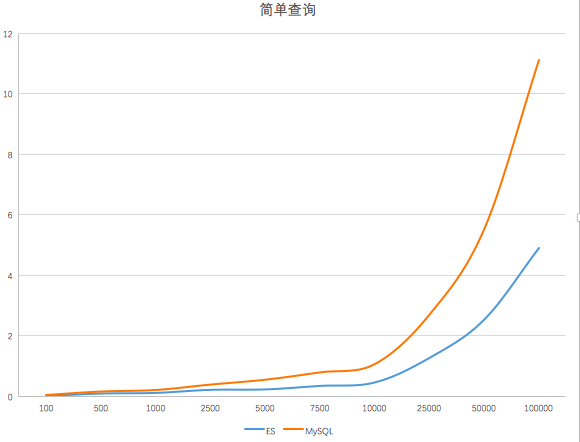
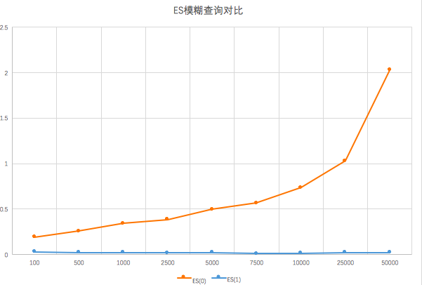
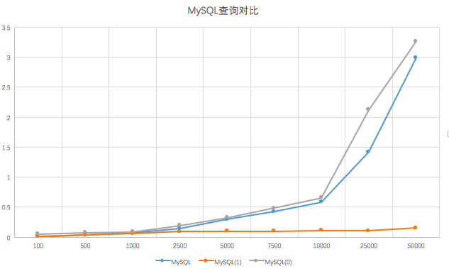
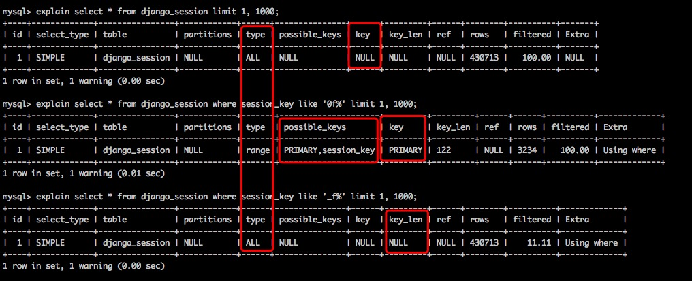
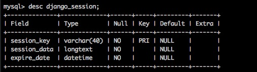
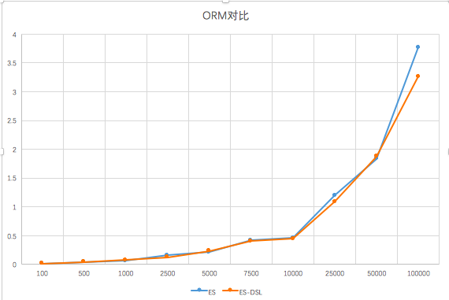

#  MySQL与ES读写性能对比	

​        我没有百万数据，仅仅只有40w，然而将这些数据从MySQL中读出用了32s，写入ES花了快30min。这真是件令人崩溃的事情。

##  读写对比

```python
 def get_mysql_data(self):
      sql = 'select * from django_session'
      start = time.time()
      cursor.execute(sql)
      
      django_sessions = cursor.fetchall(
      end = time.time()
      print("from db cost: " + str(end - start))
      id = 1
        
      if django_sessions:
          start = time.time()
          for django_session in django_sessions:
              dict_session = {
                  'id': id,
                  'key': django_session['session_key'],
                  'data': django_session['session_data'],
                  'expire_date': django_session['expire_date']
              }
              id += 1
              self.save_to_es(dict_session)
        
          end = time.time()
          print("save es cost: " + str(end - start))
        
  def save_to_es(self, item):
      client.index(
          index='test_demo',
          doc_type='test',
          body=item,
      )
```

在这里我使用了pymysql来对数据库进行访问，使用了elasticsearch来对ES进行访问。正如上面所述，我从数据库查出40w条数据用了32s，但是当我写入到ES中，用了快30min。


然后当我试着从ES中读出我写的这些数据时，我惊奇的发现竟然只用了一半的时间，并且当我向MySQL写入数据的时候，发现也比写入ES的时间少了不少。


```python
 def save_data_to_mysql(self):
      sql = 'select * from django_session'
      cursor.execute(sql)
      django_sessions = cursor.fetchall()
      start_time = time.time()
      for django_session in django_sessions:
          sql = """insert into django_session1(session_key, session_data, expire_date) values ({}, {}, {});""".format('\'' + django_session['session_key'] + '\'', '\'' + django_session['session_data'] + '\'', '\'' + str(django_session['expire_date']) + '\'')
          cursor.execute(sql)
      end_time = time.time()
      print("save mysql: " + str(end_time - start_time))
```

由此可以得出初步结论，在查找时ES比MySQL的性能好太多，而在存储数据时则远远不如MySQL。

##  查询对比

###  简单查询

先看图吧：


可以清楚的看到随着数据量的增加，查询速度会越来越慢，但MySQL的查询远远不如ES。

```mysql
# 查询语句
select * from django_session limit 1, size;
es.search(index='test_test', doc_type='test', size=size);
```

###  ES模糊查询



```mysql
# 查询语句
client.search(index='test_test', q='0f', doc_type='test', size=size)
client.search(index='test_test', q='*0f*', doc_type='test', size=size)
```

####  为什么模糊查询这么慢？

当要查找的词和词典分词不一致，就会走模糊查询。

```
模糊查询 == 未进行分词的MySQL查询 || 分词不一致
```

###  MySQL查询对比



```mysql
# 查询语句
select * from django_session limit 1, size;
select * from django_session where session_key like '0f%' limit 1, size;
select * from django_session where session_key like '_f%' limit 1, size;
```

####  索引







再来看一下我的索引选择性：


##  内存对比

##  

#  Extend




