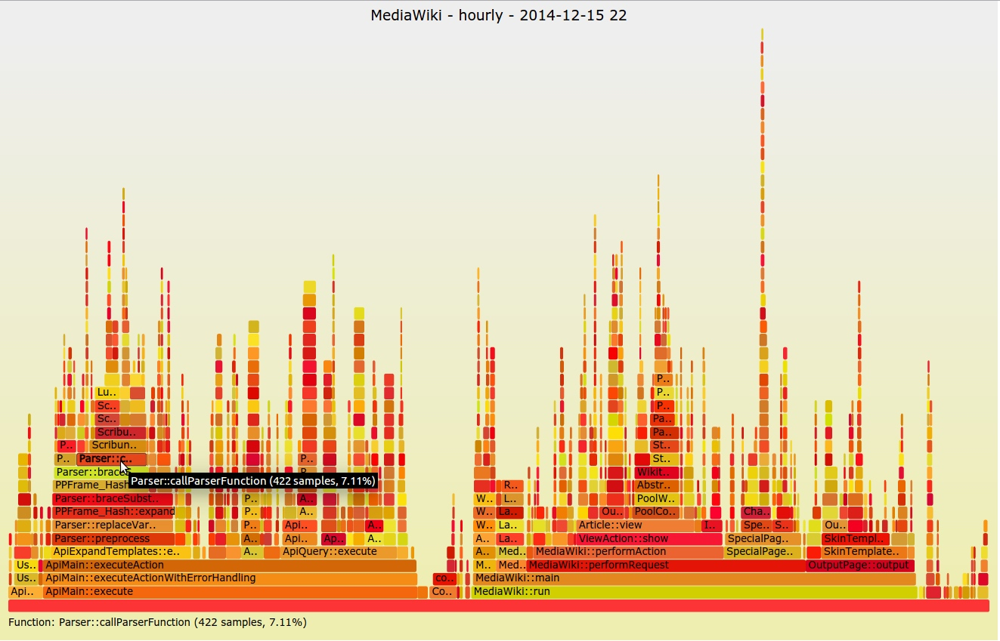
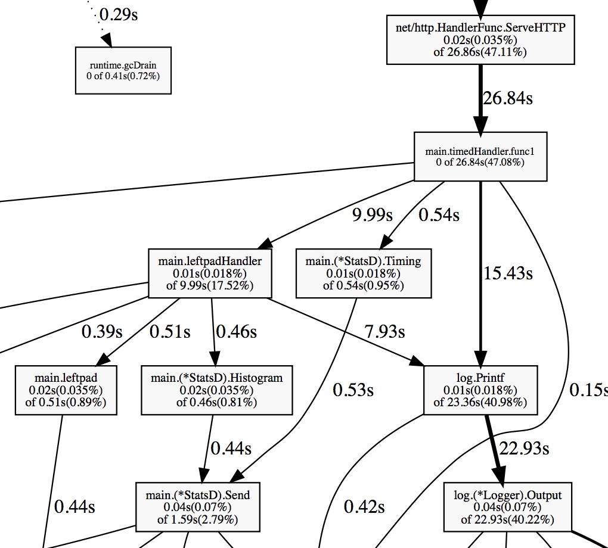

# pprof
> 根据大家之前的反馈，如果直接调研golang在哪些方面比python更有优势，可能这个事情比较虚，在系统的研究golang可以做什么之前，可以通过一些功能特性先了解下golang是什么。

## 是什么

> golang给我们第一感觉就是性能很高，如果只是语言层面的执行效率很高，还不足矣让我们构建出高性能的程序，今天跟大家分享的是帮助提高golang程序性能的一款工具，pprof。

pprof是什么，可以简单概括为golang内置支持的性能分析工具




### 组成
- runtime/pprof 取样生成性能数据，提供手动调用runtime.StartCPUProfile或者runtime.StopCPUProfile等 API来生成和写入采样文件，灵活性高
- net/http/pprof 通过http服务的形式将性能数据暴露出来，基于runtime/pprof实现
- google/pprof 用来做性能分析的可视化工具，将读取到的采样数据，生成可视化报表，帮助做性能分析

## pprof 基本用法
golang内置性能相关数据通过http服务暴露出来，由 `net/http/pprof` 包提供

### 获取性能数据
通过引入 `import _ "net/http/pprof"` 包，实现自动注册http handler。然后访问如下接口获取性能数据：

- cpu（CPU Profiling）: $HOST/debug/pprof/profile，默认进行 30s 的 CPU Profiling，得到一个分析用的 profile 文件
- block（Block Profiling）：$HOST/debug/pprof/block，查看导致阻塞同步的堆栈跟踪
- goroutine：$HOST/debug/pprof/goroutine，查看当前所有运行的 goroutines 堆栈跟踪
- heap（Memory Profiling）: $HOST/debug/pprof/heap，查看活动对象的内存分配情况
- mutex（Mutex Profiling）：$HOST/debug/pprof/mutex，查看导致互斥锁的竞争持有者的堆栈跟踪
- threadcreate：$HOST/debug/pprof/threadcreate，查看创建新OS线程的堆栈跟踪

### 使用性能数据
- 方式：`go tool pprof http://localhost:6060/debug/pprof/profile\?seconds\=60`
- 方式：`go tool pprof -http=:8080 cpu.prof`


### 解读性能数据
```bash
(pprof) top
63.77s of 69.02s total (92.39%)
Dropped 331 nodes (cum <= 0.35s)
Showing top 10 nodes out of 78 (cum >= 0.64s)
      flat  flat%   sum%        cum   cum%
    50.79s 73.59% 73.59%     50.92s 73.78%  syscall.Syscall
     4.66s  6.75% 80.34%      4.66s  6.75%  runtime.kevent
     2.65s  3.84% 84.18%      2.65s  3.84%  runtime.usleep
     1.88s  2.72% 86.90%      1.88s  2.72%  runtime.freedefer
     1.31s  1.90% 88.80%      1.31s  1.90%  runtime.mach_semaphore_signal
     1.10s  1.59% 90.39%      1.10s  1.59%  runtime.mach_semaphore_wait
     0.51s  0.74% 91.13%      0.61s  0.88%  log.(*Logger).formatHeader
     0.49s  0.71% 91.84%      1.06s  1.54%  runtime.mallocgc
     0.21s   0.3% 92.15%      0.56s  0.81%  runtime.concatstrings
     0.17s  0.25% 92.39%      0.64s  0.93%  fmt.(*pp).doPrintf
```

- flat: 采样时，该函数正在运行的次数*采样频率(10ms)，即得到估算的函数运行”采样时间”。这里不包括函数等待子函数返回。
- flat%: flat / 总采样时间值
- sum%: 前面所有行的 flat% 的累加值，如第二行 sum% = 20.82% = 11.12% + 9.70%
- cum: 采样时，该函数出现在调用堆栈的采样时间，包括函数等待子函数返回。因此 flat <= cum
- cum%: cum / 总采样时间值





## 其它：数据格式
- [profile.proto](https://github.com/google/pprof/blob/master/proto/profile.proto)

pb 其实就是个结构体，跨语言的数据传输协议描述，可以直接理解成json。
为什么要用pb，而不是json呢（方便生成具体语言所用的数据结构）

## 参考
- [go pprof 性能分析](https://wudaijun.com/2018/04/go-pprof/)
- [What is the meaning of "flat" and "cum" in golang pprof output](https://www.reddit.com/r/golang/comments/7ony5f/what_is_the_meaning_of_flat_and_cum_in_golang/dsb37ug/)
- [Profiling and optimizing Go web applications](https://artem.krylysov.com/blog/2017/03/13/profiling-and-optimizing-go-web-applications/)


