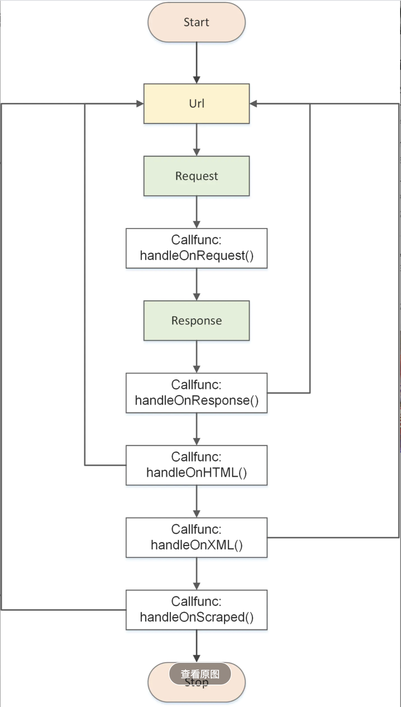

## Go爬虫初探

### colly框架尝试以及demo编写

#### 1、colly基本介绍

下图为colly的程序流程图，colly更加偏向于一种过程式的程序执行。



从图上可以看出colly通过在爬虫的各个阶段（及请求，响应，响应为html，响应为xml和xml响应后调用），通过这些回调函数，可以在爬虫的各个阶段对于所爬取内容和动作来进行进一步的处理。下面让我们来看源码。


#### 2、colly部分关键源码解析

官方示例的基础用法如下：

```go
    // 创建一个 Collector对象
    c := colly.NewCollector(
        // Visit only domains: hackerspaces.org, wiki.hackerspaces.org
        colly.AllowedDomains("hackerspaces.org", "wiki.hackerspaces.org"),
    )

    // 添加一个HTML的回调函数
    c.OnHTML("a[href]", func(e *colly.HTMLElement) {
        link := e.Attr("href")
        // Print link
        fmt.Printf("Link found: %q -> %s\n", e.Text, link)
        // Visit link found on page
        // Only those links are visited which are in AllowedDomains
        c.Visit(e.Request.AbsoluteURL(link))
    })

    // 添加一个 Requset回调函数
    c.OnRequest(func(r *colly.Request) {
        fmt.Println("Visiting", r.URL.String())
    })

    // 开始爬取
    c.Visit("https://hackerspaces.org/")
```

可以看到，主要是以一个收集器对象为单位来进行函数调用，我们可以看到collector对象的结构如下

```go
// Collector provides the scraper instance for a scraping job
type Collector struct {
    // UserAgent is the User-Agent string used by HTTP requests
    UserAgent string
    // MaxDepth limits the recursion depth of visited URLs.
    // Set it to 0 for infinite recursion (default).
    MaxDepth int
    // AllowedDomains is a domain whitelist.
    // Leave it blank to allow any domains to be visited
    AllowedDomains []string
    // DisallowedDomains is a domain blacklist.
    DisallowedDomains []string
    // DisallowedURLFilters is a list of regular expressions which restricts
    // visiting URLs. If any of the rules matches to a URL the
    // request will be stopped. DisallowedURLFilters will
    // be evaluated before URLFilters
    // Leave it blank to allow any URLs to be visited
    DisallowedURLFilters []*regexp.Regexp
    // URLFilters is a list of regular expressions which restricts
    // visiting URLs. If any of the rules matches to a URL the
    // request won't be stopped. DisallowedURLFilters will
    // be evaluated before URLFilters

    // Leave it blank to allow any URLs to be visited
    URLFilters []*regexp.Regexp

    // AllowURLRevisit allows multiple downloads of the same URL
    AllowURLRevisit bool
    // MaxBodySize is the limit of the retrieved response body in bytes.
    // 0 means unlimited.
    // The default value for MaxBodySize is 10MB (10 * 1024 * 1024 bytes).
    MaxBodySize int
    // CacheDir specifies a location where GET requests are cached as files.
    // When it's not defined, caching is disabled.
    CacheDir string
    // IgnoreRobotsTxt allows the Collector to ignore any restrictions set by
    // the target host's robots.txt file.  See http://www.robotstxt.org/ for more
    // information.
    IgnoreRobotsTxt bool
    // Async turns on asynchronous network communication. Use Collector.Wait() to
    // be sure all requests have been finished.
    Async bool
    // ParseHTTPErrorResponse allows parsing HTTP responses with non 2xx status codes.
    // By default, Colly parses only successful HTTP responses. Set ParseHTTPErrorResponse
    // to true to enable it.
    ParseHTTPErrorResponse bool
    // ID is the unique identifier of a collector
    ID uint32
    // DetectCharset can enable character encoding detection for non-utf8 response bodies
    // without explicit charset declaration. This feature uses https://github.com/saintfish/chardet
    DetectCharset bool
    // RedirectHandler allows control on how a redirect will be managed
    RedirectHandler func(req *http.Request, via []*http.Request) error
    // CheckHead performs a HEAD request before every GET to pre-validate the response
    CheckHead         bool
    store             storage.Storage
    debugger          debug.Debugger
    robotsMap         map[string]*robotstxt.RobotsData
    htmlCallbacks     []*htmlCallbackContainer
    xmlCallbacks      []*xmlCallbackContainer
    requestCallbacks  []RequestCallback
    responseCallbacks []ResponseCallback
    errorCallbacks    []ErrorCallback
    scrapedCallbacks  []ScrapedCallback
    requestCount      uint32
    responseCount     uint32
    backend           *httpBackend
    wg                *sync.WaitGroup
    lock              *sync.RWMutex
}
```

注释大部分都可以看懂，比较关键的有几个，各个回调函数的调用栈，，以及并发调用的锁操作和等待队列。

之后可以看到，除了各个回调函数外，主要的函数调用集中在Visit()方法里

```go
// Visit starts Collector's collecting job by creating a
// request to the URL specified in parameter.
// Visit also calls the previously provided callbacks
func (c *Collector) Visit(URL string) error {
    if c.CheckHead {
        if check := c.scrape(URL, "HEAD", 1, nil, nil, nil, true); check != nil {
            return check
        }
    }
    return c.scrape(URL, "GET", 1, nil, nil, nil, true)
}
```

```go
func (c *Collector) scrape(u, method string, depth int, requestData io.Reader, ctx *Context, hdr http.Header, checkRevisit bool) error {
    // 检查请求是否合法
    if err := c.requestCheck(u, method, depth, checkRevisit); err != nil {
        return err
    }
    // 解析url，
    parsedURL, err := url.Parse(u)
    if err != nil {
        return err
    }
    if parsedURL.Scheme == "" {
        parsedURL.Scheme = "http"
    }
    if !c.isDomainAllowed(parsedURL.Hostname()) {
        return ErrForbiddenDomain
    }
    // robots协议
    if method != "HEAD" && !c.IgnoreRobotsTxt {
        if err = c.checkRobots(parsedURL); err != nil {
            return err
        }
    }
     // headers
    if hdr == nil {
        hdr = http.Header{"User-Agent": []string{c.UserAgent}}
    }
    rc, ok := requestData.(io.ReadCloser)
    if !ok && requestData != nil {
        rc = ioutil.NopCloser(requestData)
    }
    // The Go HTTP API ignores "Host" in the headers, preferring the client
    // to use the Host field on Request.
    host := parsedURL.Host
    if hostHeader := hdr.Get("Host"); hostHeader != "" {
        host = hostHeader
    }
    // 构造http.Request
    req := &http.Request{
        Method:     method,
        URL:        parsedURL,
        Proto:      "HTTP/1.1",
        ProtoMajor: 1,
        ProtoMinor: 1,
        Header:     hdr,
        Body:       rc,
        Host:       host,
    }
    // 请求的数据（requestData）转换成io.ReadCloser接口数据
    setRequestBody(req, requestData)
    u = parsedURL.String()
    c.wg.Add(1)
    // 异步方式
    if c.Async {
        go c.fetch(u, method, depth, requestData, ctx, hdr, req)
        return nil
    }
    return c.fetch(u, method, depth, requestData, ctx, hdr, req)
}
```

上面代码为构建http请求即请求前处理，而关键的代码如下，即fetch函数，fetch展示了爬虫的整个过程，其中的关键部分进行了标注。

```go
func (c *Collector) fetch(u, method string, depth int, requestData io.Reader, ctx *Context, hdr http.Header, req *http.Request) error {
    defer c.wg.Done()
    if ctx == nil {
        ctx = NewContext()
    }
    request := &Request{
        URL:       req.URL,
        Headers:   &req.Header,
        Ctx:       ctx,
        Depth:     depth,
        Method:    method,
        Body:      requestData,
        collector: c, // 这里将Collector放到request中，这个可以对请求继续处理
        ID:        atomic.AddUint32(&c.requestCount, 1),
    }
    // 回调函数处理 request
    c.handleOnRequest(request)

    if request.abort {
        return nil
    }

    if method == "POST" && req.Header.Get("Content-Type") == "" {
        req.Header.Add("Content-Type", "application/x-www-form-urlencoded")
    }

    if req.Header.Get("Accept") == "" {
        req.Header.Set("Accept", "*/*")
    }

    origURL := req.URL
    // 这里是 去请求网络， 是调用了 `http.Client.Do`方法请求的
    response, err := c.backend.Cache(req, c.MaxBodySize, c.CacheDir)
    if proxyURL, ok := req.Context().Value(ProxyURLKey).(string); ok {
        request.ProxyURL = proxyURL
    }
    // 回调函数，处理error
    if err := c.handleOnError(response, err, request, ctx); err != nil {
        return err
    }
    if req.URL != origURL {
        request.URL = req.URL
        request.Headers = &req.Header
    }
    atomic.AddUint32(&c.responseCount, 1)
    response.Ctx = ctx
    response.Request = request

    err = response.fixCharset(c.DetectCharset, request.ResponseCharacterEncoding)
    if err != nil {
        return err
    }
    // 回调函数 处理Response
    c.handleOnResponse(response)
    
    // 回调函数 HTML
    err = c.handleOnHTML(response)
    if err != nil {
        c.handleOnError(response, err, request, ctx)
    }
    // 回调函数XML
    err = c.handleOnXML(response)
    if err != nil {
        c.handleOnError(response, err, request, ctx)
    }
    // 回调函数 Scraped
    c.handleOnScraped(response)

    return err
}


```

回调函数，主要通过遍历回调栈中的指针查看是否有为完成的回调函数

```go
func (c *Collector) handleOnRequest(r *Request) {
    if c.debugger != nil {
        c.debugger.Event(createEvent("request", r.ID, c.ID, map[string]string{
            "url": r.URL.String(),
        }))
    }
    for _, f := range c.requestCallbacks {
        f(r)
    }
}
```

一个比较主要的回调函数，onHtml解析html页面，可以看到回调栈的创建和插入是需要上锁，防止栈的插入异常导致

```go
// OnHTML registers a function. Function will be executed on every HTML
// element matched by the GoQuery Selector parameter.
// GoQuery Selector is a selector used by https://github.com/PuerkitoBio/goquery
func (c *Collector) OnHTML(goquerySelector string, f HTMLCallback) {
    c.lock.Lock()
    if c.htmlCallbacks == nil {
        c.htmlCallbacks = make([]*htmlCallbackContainer, 0, 4)
    }
    c.htmlCallbacks = append(c.htmlCallbacks, &htmlCallbackContainer{
        Selector: goquerySelector,
        Function: f,
    })
    c.lock.Unlock()
}

// 这个解析html的逻辑比较多一些
func (c *Collector) handleOnHTML(resp *Response) error {
    if len(c.htmlCallbacks) == 0 || !strings.Contains(strings.ToLower(resp.Headers.Get("Content-Type")), "html") {
        return nil
    }
    doc, err := goquery.NewDocumentFromReader(bytes.NewBuffer(resp.Body))
    if err != nil {
        return err
    }
    if href, found := doc.Find("base[href]").Attr("href"); found {
        resp.Request.baseURL, _ = url.Parse(href)
    }
    for _, cc := range c.htmlCallbacks {
        i := 0
        doc.Find(cc.Selector).Each(func(_ int, s *goquery.Selection) {
            for _, n := range s.Nodes {
                e := NewHTMLElementFromSelectionNode(resp, s, n, i)
                i++
                if c.debugger != nil {
                    c.debugger.Event(createEvent("html", resp.Request.ID, c.ID, map[string]string{
                        "selector": cc.Selector,
                        "url":      resp.Request.URL.String(),
                    }))
                }
                cc.Function(e)
            }
        })
    }
    return nil
}

```

最后比较重要的是可以通过调用request中带有的collector指针执行跳转，可以实现下一页的爬取逻辑

```go
   // On every a element which has href attribute call callback
   c.OnHTML("a[href]", func(e *colly.HTMLElement) {
       {...}
       // start scaping the page under the link found
       e.Request.Visit(link)
   })
```


#### 3、个人demo

实现了一个可以通过作者名爬取csdn相应作者下的所有博客，因为时间问题项目还存在很多待优化的地方。

在爬虫的基础上我加上了等待队列对url列表中的url做并发请求并写入文件，同时主进程等待。

```go
package main

import (
	"fmt"
	"github.com/gocolly/colly"
	"github.com/gocolly/colly/debug"
	"log"
	"os"
	"strings"
	"sync"
	"time"
)

var wg sync.WaitGroup

func getArticleAndWriteFile(url string) {
	logWriter, err := os.OpenFile("./getArticleLog.txt", os.O_RDWR|os.O_CREATE, 0666)
	if err != nil {
		panic(err)
	}

	collector := colly.NewCollector(
		colly.Debugger(&debug.LogDebugger{Output: logWriter}),
		colly.MaxDepth(1))

	collector.OnHTML("main", func(html *colly.HTMLElement) {

		title := html.ChildText("h1[class=title-article]")
		// 解决出现/导致无法存入文件的问题
		if strings.Contains(title, "/") {
			title = strings.ReplaceAll(title, "/", "或")
		}

		htmlWriter, err := os.OpenFile("./"+title+".txt", os.O_RDWR|os.O_CREATE|os.O_TRUNC, 0666)
		if err != nil {
			panic(err)
		}

		content := html.ChildText("div[id=article_content]")
		if _, err = htmlWriter.WriteString(content); err != nil {
			log.Printf("title write err: %v", err)
		}
	})

	if err := collector.Visit(url); err != nil {
		panic(err)
	}

	wg.Done()
}

func getArticleUrls(url string) []string {

	var urls []string

	logWriter, err := os.OpenFile("./getUrlsLog.txt", os.O_RDWR|os.O_CREATE|os.O_TRUNC, 0666)
	if err != nil {
		panic(err)
	}

	collector := colly.NewCollector(
		colly.Debugger(&debug.LogDebugger{Output: logWriter}),
		colly.MaxDepth(1))

	collector.OnHTML("a[href]", func(a *colly.HTMLElement) {
		url := a.Attr("href")
		if strings.Contains(url, "/article/details") {
			urls = append(urls, url)
		}
	})

	if err := collector.Visit(url); err != nil {
		panic(err)
	}

	return urls
}

func getArticles(name string) {
	userUrl := "https://blog.csdn.net/" + name + "/"
	for _, articleUrl := range getArticleUrls(userUrl) {
		wg.Add(1)
		go getArticleAndWriteFile(articleUrl + "/")
	}
	wg.Wait()
}

func main() {
	start := time.Now()

	getArticles("weixin_41021172")

	fmt.Println(time.Since(start))
}
```


