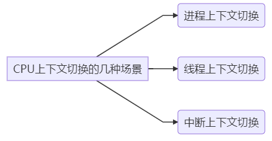
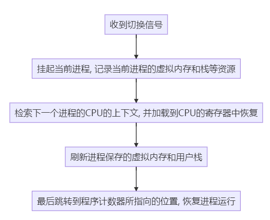
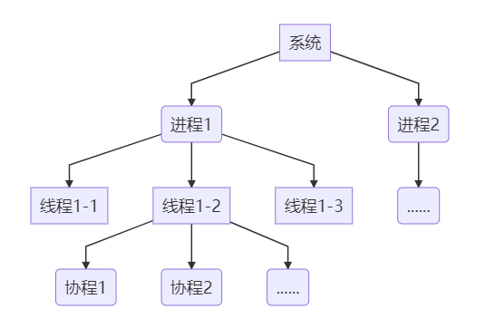

## `Python3`异步编程的原由

#### I/O密集型 vs 计算密集型

- **I/O密集型**：涉及到网络、磁盘I/O的任务都是I/O密集型任务。这类任务的特点是CPU消耗资源很少，任务的大部分时间都在等待I/O操作完成（对于I/O密集型的任务，最适合的语言就是开发效率高的语言-->**脚本语言是首选**）

- **计算密集型**：需要进行大量的计算，消耗很多CPU资源（计算密集型任务最好用C语言去编写）

- **总之**，计算密集型程序适合C语言编写多线程，I/O密集型适合脚本语言开发的多线程。

- **参考链接**：
  - http://km.oa.com/group/34294/articles/show/392052?kmref=search&from_page=1&no=2

---

#### CPU上下文切换

- ##### 概念：

  - 把前一个任务的CPU上下文保存下来
  - 找到并加载新任务的上下文
  - 切换到新的CPU寄存器和程序计数器最后跳到程序计数器所指的新位置，开始运行新任务。

- ##### 看看分类

  
  
  - ##### 进程上下文切换过程
  
    
  
- ##### 线程上下文切换 vs 进程上下文切换
  
  - 当进程只有一个线程的时候，进程就等于线程
    
    - 当进程有多个线程的时候，这些线程会共享相同的虚拟内存与全局变量等资源，**这些在上下文切换的时候不需要修改**
  - 线程也是有私有数据的，这些数据在上下文切换的时候是需要保存的，但是，多线程间的切换会比多进程间的切换消耗更少的资源
  
  - ##### 中断上下文切换
  
    - 概念：为了快速响应硬件事件，中断处理会打断进程的正常调度和执行，转而执行调用中断处理程序，响应设备事件。
    - 中断上下文切换  vs 进程上下文切换：中断上下文切换不会涉及到进程的用户态，只是需要内核态中断程序执行必需的状态，并且对于一个CPU来说，中断处理比进程拥有更高的优先级。

---

#### 进程、线程、协程（纤程）

- ##### 看看他们之间的关系

- ##### 进程

  - 进程是资源分配的最小单位
  - 进程间不共享内存，每个进程拥有自己独立的内存
  - 进程间可以通过信号、信号量、共享内存、管道、队列等来通信
  - 新开进程开销大，并且 CPU 切换进程成本也大
  - 进程由操作系统调度
  - 多进程方式比多线程更加稳定

- ##### 线程

  - 线程是程序执行流的最小单位
  - 线程是来自于进程的，一个进程下面可以开多个线程
  - 每个线程都有自己一个栈，不共享栈，但多个线程能共享同一个属于进程的堆
  - 线程因为是在同一个进程内的，可以共享内存
  - 线程也是由操作系统调度，线程是 CPU 调度的最小单位
  - 新开线程开销小于进程，CPU 在切换线程成本也小于进程
  - **某个线程发生致命错误会导致整个进程崩溃**
  - 线程间读写变量存在锁的问题处理起来相对麻烦

- ##### 协程

  - 一种用户态的、非抢占式的轻量级线程
  - 由应用程序显式调度，然后选择合适的线程来获取执行权
  - 切换非常快，成本低。一般占用栈大小远小于线程（协程 KB 级别，线程 MB 级别），所以可以开更多的协程

- ##### 协程与异步和并发的联系

  - 协程与异步：协程并不是说替换异步，**协程和异步结合可以实现高并发**
  - 协程与并发：协程要利用多核优势就需要通过比如调度器来实现多协程在多线程上运行，这时也就具有了并行的特性；如果多协程运行在单线程或单进程上也就只能说具有并发特性
  - 简单拓展一下**并行**和**并发**：并行是利用富余计算资源（比如：多核CPU）加速完成多个任务为目的，多个任务是<u>同时</u>进行的；并发是利用有限的计算机资源使多个任务可以被<u>实时或近实时</u>执行。

---

##### 小结：实际的应用中，线程 + 协程是一个较好的高并发解决方案

---

##### 参考链接：

- http://km.oa.com/articles/show/398153?kmref=search&from_page=2&no=8
- https://cloud.tencent.com/developer/article/1187407