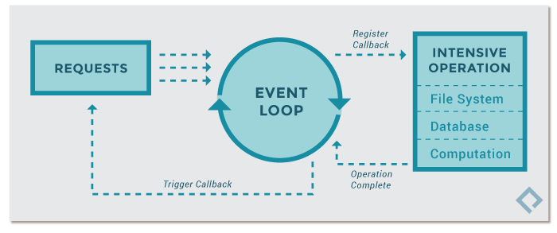
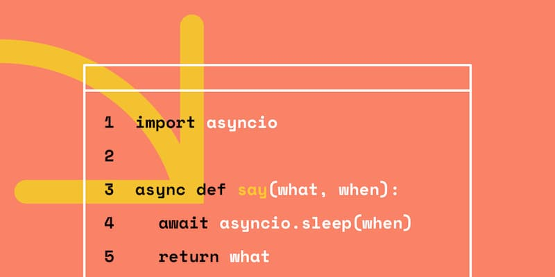

## aynsc的基础原理


----



asyncio 模块在单线程上启动一个事件循环（event loop），时刻监听新进入循环的事件，加以处理，并不断重复这个过程，直到异步任务结束


 `asyncio`  模块最主要的几个API。


基本使用方式：




## 开发版本注意事项
我们最需要注意的是 相对于 3.6 来说， 3.7 在语法上几乎是完全 兼容， 除了如下这一点：


async and await are now reserved keywords


所以，如果项目 目前使用的是 Python 3.6 ，而且项目又比较大的话，个人建议不用太着急转到 3.7 上去。 因为不知道你的项目代码和依赖的第三方库的代码是不是做过3.7的兼容性测试， 毕竟 3.7 刚刚出来不久。

尽量避免async和await作为变量名存在，避免以后迁移出现兼容性问题。

## 协程
```python
import asyncio

async def compute(x, y):
    print("Compute %s + %s ..." % (x, y))
    await asyncio.sleep(1.0)
    return x + y

async def print_sum(x, y):
    result = await compute(x, y)
    print("%s + %s = %s" % (x, y, result))

loop = asyncio.get_event_loop()
loop.run_until_complete(print_sum(1, 2))
loop.close()
```

> Compute 1 + 2 ...
> 
1 + 2 = 3

时序图：


```python
import asyncio

async def compute(x, y):
    print("Compute %s + %s ..." % (x, y))
    await asyncio.sleep(1.0)
    return x + y

async def compute1(x, y):
    print("Compute %s * %s ..." % (x, y))
    await asyncio.sleep(1.0)
    return x * y

async def print_sum(x, y):
    result = await compute(x, y)
    result1 = await compute1(x, y)
    print("%s + %s = %s" % (x, y, result))
    print("%s * %s = %s" % (x, y, result1))

loop = asyncio.get_event_loop()
loop.run_until_complete(print_sum(1, 2))
loop.close()
```
>Compute 1 + 2 ...
>
Compute 1 * 2 ...
> 
> 1 + 2 = 3
> 
> 1 * 2 = 2
