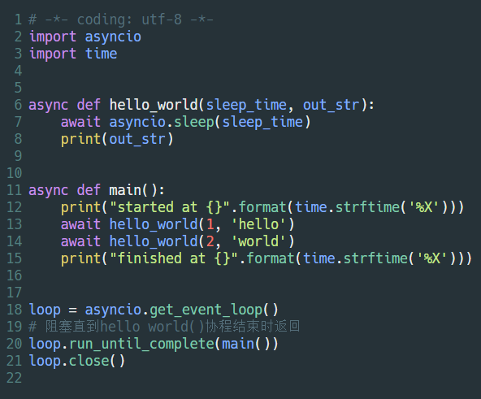
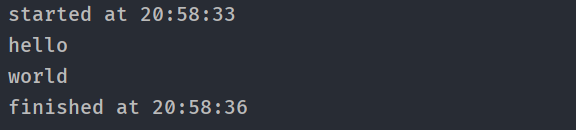
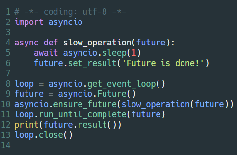
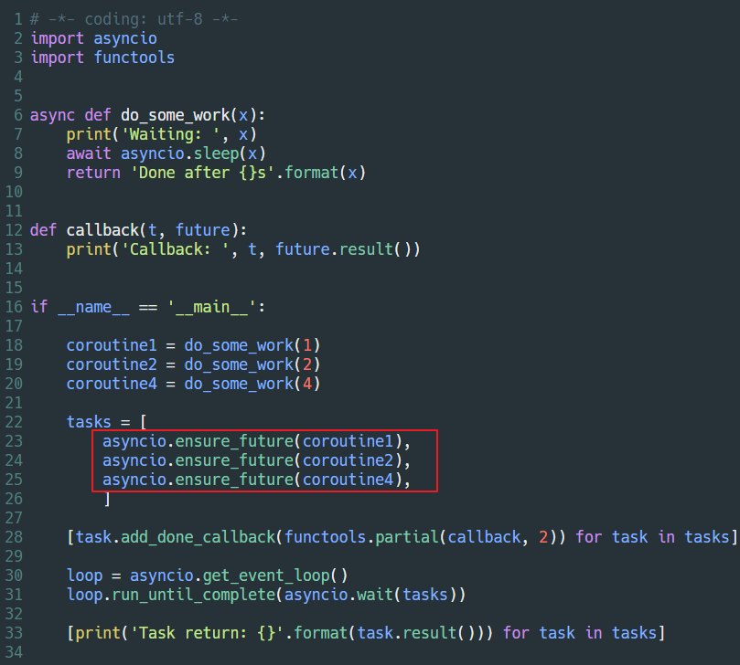
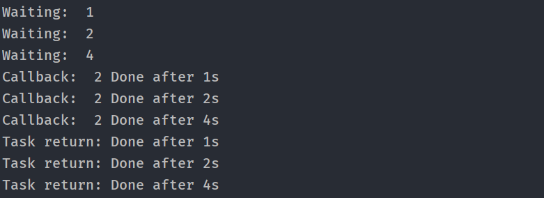
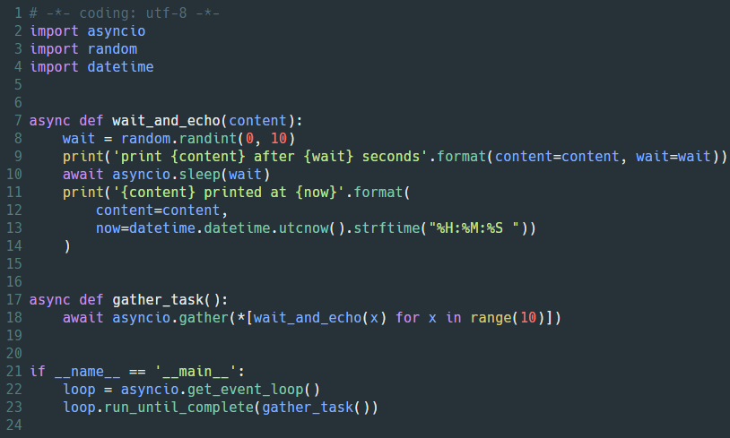
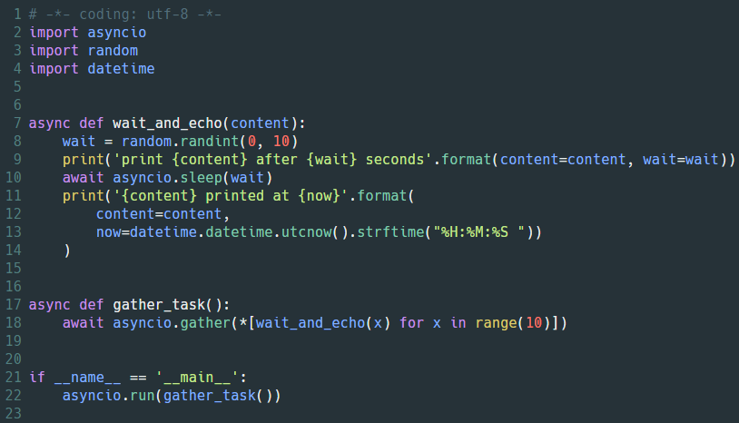
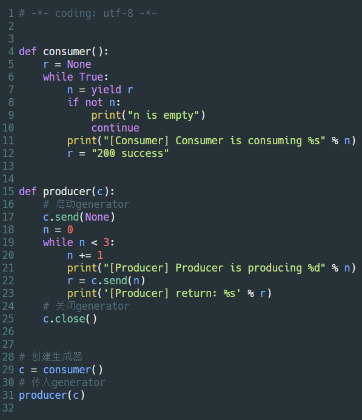
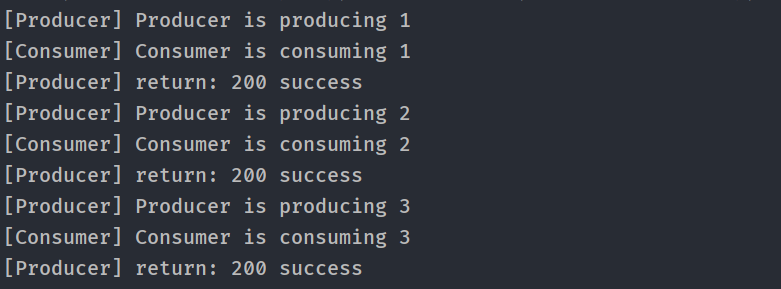

### 协程

---

#### async | await：

- 在Python3.4中引入了asyncio.coroutine装饰器来标志函数作为协程函数，与asyncio的事件循环一同使用
- 在Python3.5中引入了async/await，其中async替代asyncio.coroutine装饰器，await替代yield from，从而让协程的实现更加直观
- async/await和yield frome这两种不同风格的协程在底层其实是相互复用相互兼容的
- 在Python3.6中asyncio库“转正”，成为正式的标准库

- 可等待对象（Awaitables）：

  - 「可等待对象」通常有3类，分别是：
    - 协程(coroutine)
    - 任务(Task)
    - 未来对象(Future)
  - 有一个比较直观的判断方法：如果一个对象能够被用在 await 表达式中，那么就可以称这个对象为 「可等待对象」

---

- 看一个例子：

  

- 执行结果：

  

---

### gather | await

#### gather：

- 收集所有协程的执行结果，并封装成列表返回

#### await：

- 返回已完成的Task对象集合和未完成的对象集合
- 我们可以自定义是否等待所有Task对象完成或者是第一个Task对象完成，也可以设置超时时间

##### 参考链接：

https://stackoverflow.com/questions/42231161/asyncio-gather-vs-asyncio-wait

---

### Future  | Task

#### Future

- Future对象封装了一个未来会被计算的可调用的异步执行对象，他们能被放入队列，他们的状态、结果或者异常能被查询

- Future对象有一个`result`属性，用于存放未来的执行结果，对应的还有个`set_result()`方法，是用于设置`result`的，并且会在给`result`绑定值以后运行事先给Future对象添加的回调。回调是通过Future对象的`add_done_callback()`方法添加的

- Future对象一般不用开发者手动创建，这里只是作为演示：

  

---

#### Tasks

- Task是对协程的进一步封装，同时也是Future的子类

- task可以理解为：由单个coroutine，经过ensure_future方法封装而成（多个task可以经过asyncio.gather / asyncio.wait 处理形成一个future）
  
- 被封装的task对象不能直接运行，需要注册事件循环之后，载由run_until_complete方法来运行task对象
  
- task中包含协程的各种执行状态：
  
  - Pending（等待）
  - Running（执行中）
  - Done（执行完成）
  - Cancelled（取消）
  
- 将协程封装成Task的方法：调用asyncio.ensure_future(协程)，例如：

  

- 执行结果：

  

---

### asyncio差异比较：Python3.6 vs Python3.7

##### 异步事件循环：

- 在Python3.7以前的版本，调用异步函数前要先调用`asyncio.get_event_loop()`函数获取事件循环`loop`对象，然后通过不同的策略调用`loop.run_forever()`方法或者`loop.run_until_complete()`方法执行异步函数。一个典型的例子是这样的：

- python3.6的写法：

  

- Python3.7的写法：

  

- 运行结果并没有差异。看了一下源码，Python3.7里面，run()函数把创建 / 取消 / 关闭 事件循环封装起来了，让使用者更方便而已

---

##### asyncio.create_task | asyncio.ensure_future

- 第一种方法在 Python 3.7 中被加入，返回Task对象，看源码得知：该方法时使用Python3.7中新加入的一个钩子函数get_running_loop()来获取当前事件循环，然后用该事件循环将传入的协程封装并返回
- 第二种方法非常相似，当传入协程时返回一个Task对象；唯一的区别是它也可以接受Future对象或Task对象，在这种情况下它不会做任何事情并且返回Future对象或者Task对象不变

---

#### 补充：对yield关键字的理解

##### 为什么第一次必须向生成器send(None)?

- 代码示例：

  

- 执行结果：

  

- 代码分析：
  - 首先，需要明确一点：从程序执行流程来看, 赋值操作的 = 语句都是从右边开始执行的
  - 来看 n = yield r 这个表达式, 如果这个表达式只是n = r, 相信每个人都能理解是把r的值赋值给了n(有可能是引用, 不过不碍事)
  - 而现在等号右边是一个yield r,所以先要执行yield r, 然后才是赋值；但是yield把r返回到了调用者那里。这个表达式的下一步操作（赋值）因为等号右边的yield被暂停了，换句话说：n = yield r才执行了一半
  - 当调用者通过send(“变量名”)回到生成器函数时，是从上次暂停的地方开始的，所以，send进去的值会被赋给n，然后打印，然后下一次循环到yield又暂停，周而复始

##### send(var)之前必须启动生成器，为什么呢？

- 生成器刚启动的时候，consumer()函数运行到yield r时会把r的值返回给调用者，并不会执行赋值操作，所以send具体的值会导致程序的执行顺序错乱，从而报错。

- **关键点：send(“变量名”)操作是发生在回到consumer()函数的时候，而不是一开始从consumer()函数出来的时候。**

