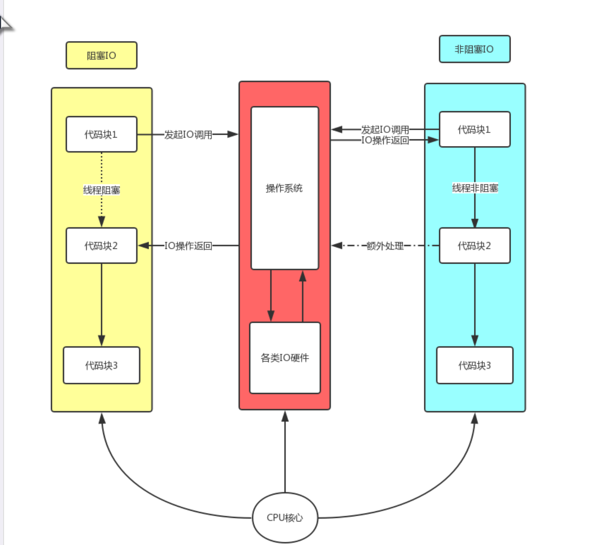
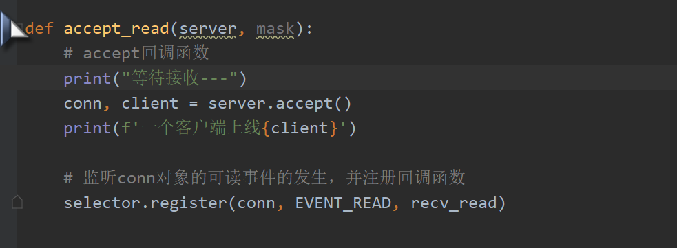
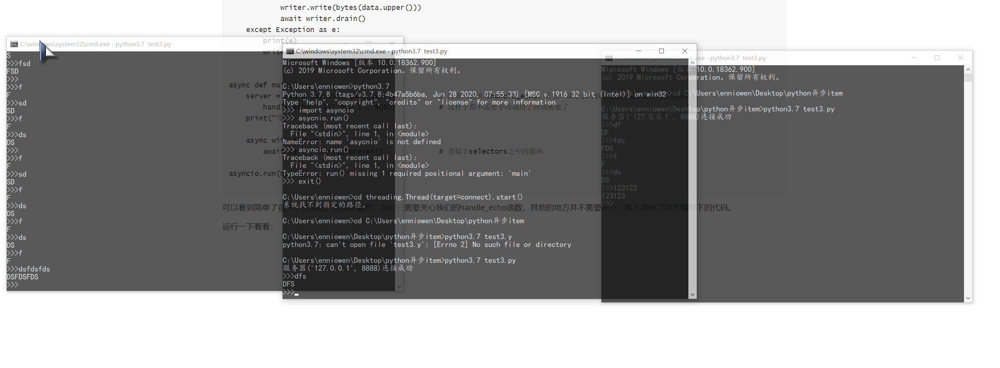

## 本文是关于这几个问题的。

## 为什么要用异步模型？原理是什么？进行异步编程时候，async/await/asyncio帮助我们做了什么，简化了哪些操作？

至于async和await的具体使用，这篇博客看着还可以。https://www.bbsmax.com/A/gGdX3Xj154/

一一个简单的例子：

### 单进程，单线程，阻塞IO

```
# 服务器端
import socket

addr = ('127.0.0.1', 8080)
server = socket.socket(socket.AF_INET, socket.SOCK_STREAM)
server.bind(addr)
server.listen(5)
print('监听中...')

while True:  # 链接循环
    conn, client = server.accept()
    print(f'一个客户端上线 -> {client}')

    while True:  # 消息循环
        try:
            request = conn.recv(1024)
            if not request:
                break
            print(f"request: {request.decode('utf-8')}")
            conn.send(request.upper())

        except ConnectionResetError as why:
            print(f'客户端丢失，原因是: {why}')
            break

    conn.close()

```

缺点明显，无法并发。

### 多进程，阻塞IO：

```
import socket
from multiprocessing import Process

def task(conn):
    """通信循环处理函数"""

    while True:
        try:
            request = conn.recv(1024)
            if not request:
                break
            print(f"request: {request.decode('utf-8')}")
            conn.send(request.upper())

        except ConnectionResetError as why:
            print(f'客户端丢失，原因是: {why}')
            break

if __name__ == '__main__':  # windows下需要把新建进程写到main中，不然会报错
    addr = ('127.0.0.1', 8080)
    server = socket.socket(socket.AF_INET, socket.SOCK_STREAM)
    server.bind(addr)
    server.listen(5)
    print('监听中...')

    while True:
        conn, client = server.accept()
        print(f'一个客户端上线 -> {client}')

        p = Process(target=task, args=(conn,))  # 开启子进程处理与用户的消息循环
        p.start()
```


### 多线程，阻塞IO

```
服务器端代码
import socket
from threading import Thread

def task(conn):
    """通信循环处理函数"""

    while True:
        try:
            request = conn.recv(1024)
            if not request:
                break
            print(f"request: {request.decode('utf-8')}")
            conn.send(request.upper())

        except ConnectionResetError as why:
            print(f'客户端丢失，原因是: {why}')
            break

if __name__ == '__main__':
    addr = ('127.0.0.1', 8080)
    server = socket.socket(socket.AF_INET, socket.SOCK_STREAM)
    server.bind(addr)
    server.listen(5)
    print('监听中...')

    while True:
        conn, client = server.accept()
        print(f'一个客户端上线 -> {client}')

        t = Thread(target=task, args=(conn,))  # 启动多线程处理与用户的消息循环
        t.start()
```

可以并发，但是并发高了之后，线程切换耗费资源太多，

#### 两者本质：阻塞IO，IO调用会阻塞当前线程。


### 使用非阻塞IO实现并发，异步模型产生。


### 异步模型：

高并发情况下，如果有很多io操作，可以通过创建很多个线程来监控处理这些io请求(阻塞IO)，这种方式编码好理解，也很简单，但是维护线程无疑会耗费一定的资源，并且并发高了之后可能出现线程安全问题。所以这时候就有异步模型，这种模型是通过一个线程（非阻塞IO）来处理高并发，省去了线程维护所消耗的资源，其实就是一种编码方式.

因为这种程序运行方式编写起来有困难，所以就有了很多异步框架来帮助我们完成这些事情。

另外，能够异步的原因是因为一个IO请求分为两步，发起IO请求和实际的IO操作，实际的IO操作与CPU无关，所以可以异步。

先明白几个概念

### 同步、异步 ----------任务执行模型，发起IO请求是否阻塞，程序层面的

举一个例子，比如现在我要烧水和看电视(两个任务)，人是cpu，电磁炉是io，

对于烧水这个任务，分为两步执行：

1.给水壶灌满水，放在电磁炉上开始烧水。这一步必须人来做，占用cpu资源。

2.电磁炉发热加热水直到水烧开。这一步和人无关，占用io资源，是一个io操作。

3.将水灌入电壶。消耗cpu资源。

对于看电视这个任务，必须要消耗cpu资源。

同步：人(cpu)先去执行烧水任务第一步，然后在旁边看着，等待电磁炉把水烧开(消耗io资源)，水烧开之后，灌水，再去看电视。

异步：可以看到烧水的第二步和人并没有关系，人(cpu)等待水开(io操作)，浪费了人的精力(浪费cpu) ，为了避免人(cpu)盲目等待，我们可以在执行完烧水的第一步之后，就去看电视，等水烧开了再去将水灌入电壶。这样可以提高人(cpu)的利用率，从整体上降低程序运行时间。

简单来讲，同步就是cpu一步一步的处理每一个任务，异步就是处理一个任务时候，如果该任务部分代码并不消耗cpu资源，消耗其他资源(io)，这时候先让cpu去执行其他任务。

所以就是说当io操作比较多，并且任务与任务之间的关联性不是很强时候，可以采用异步方式来并发执行任务。

## 阻塞IO，非阻塞IO  ------IO调用模型，执行IO操作时候是否阻塞，针对操作系统接口的



网上找的图，一看就明白，阻塞IO和非阻塞IO是操作系统提供的两种不同的IO接口，一种立即返回一个状态值，不会阻塞当前线程，另一种会阻塞当前线程直到IO操作完成，


## 异步模型的实现

首先明白，异步模型是基于非阻塞IO的，因为是异步模型通过一个线程来处理并发请求的，所以如果一IO请求阻塞当前线程，那就没有办法再去发起其它的IO请求了，自然也无法实现。

实现的基本思路：每当有IO操作时候，调用操作系统的IO接口发起IO请求，然后将该IO请求加入到待处理列表之中，之后继续接受来到的IO操作，发起IO请求，加入待处理列表。那么待处理列表之中的IO请求已经执行完毕，要对它进行处理时候，该怎么解决呢？有两种常见的方法：

#### 1.轮询，

按照一定的规则，周期性的遍历待处理列表，对于其中已经就绪的IO请求进行下一步处理，这里已经就绪的IO请求指的是操作系统已经处理完成的IO请求。

轮询无疑是效率低下的，因为对于待处理列表之中未就绪的IO请求，遍历它是对CPU的浪费，轮询是主动的询问IO请求是否已经就绪，如果能够将主动变为被动，那就可以减少不必要的操作，提高cpu利用率。

- **非阻塞IO+try+轮询**

- **非阻塞IO+select代理轮询**

  

  ### 2..回调函数+事件循环

回调函数顾名思义，就是指当我们将IO请求放入到待处理列表之中时候，给它注册一个函数，当IO请求被操作系统处理完毕之后，就去调用这个函数，执行对应的代码。事件循环指的就是不断从就绪列表之中取出来就绪事件进行处理。

这种方式相当于是当有就绪事件时候，通知CPU进行处理。

回调函数+事件循环自己实现起来比较麻烦，Python当中的selectors已经封装好了。

根据下面这个C/S例子理解这几个点：

简要说明：python借助socket完成的一个网络编程的例子，服务器端借助selectors完成单线程可以并发处理多个客户端的请求。

```
# 服务器端代码
import socket
from selectors import DefaultSelector, EVENT_READ


def recv_read(conn, mask):
    # recv回调函数
    try:
        request = conn.recv(1024)
        if not request:
            # 意味着链接失效，不再监控此socket
            conn.close()
            selector.unregister(conn)
            # 结束此回调的执行
            return None
        # 链接正常，处理数据
        print(conn)
        conn.send(request.upper())

    except (ConnectionResetError, ConnectionAbortedError):
        # 链接失效
        conn.close()
        selector.unregister(conn)


def accept_read(server, mask):
    # accept回调函数
    print("等待接收---")
    conn, client = server.accept()
    print(f'一个客户端上线{client}')

    # 监听conn对象的可读事件的发生，并注册回调函数
    selector.register(conn, EVENT_READ, recv_read)


if __name__ == '__main__':
    addr = ('127.0.0.1', 8080)
    server = socket.socket(socket.AF_INET, socket.SOCK_STREAM)
    server.bind(addr)
    server.setblocking(False)    # 设置阻塞IO/非阻塞IO
    server.listen(5)
    print('监听中...')

    # 获取对象
    selector = DefaultSelector()
    # 第一个注册,监听server对象的可读事件的发生，并注册回调函数
    selector.register(server, EVENT_READ, accept_read)

    # 执行事件循环
    while True:
        # 循环调用select，select是阻塞调用，返回就绪事件
        events = selector.select()
        for key, mask in events:
            print('------', key.data, mask)
            # 获取此事件预先注册的回调函数
            callback = key.data
            # 对此事件中准备就绪的socket对象执行回调
            callback(key.fileobj, mask)
```

客户端代码：

```
# 客户端
import socket
import threading


def connect():
    addr = ('127.0.0.1', 8080)
    client = socket.socket(socket.AF_INET, socket.SOCK_STREAM)
    client.connect(addr)
    print(f'服务器{addr}连接成功')

    while True:  # 消息循环
        inp = input('>>>').strip()
        if not inp:
            continue

        try:
            client.send(inp.encode('utf-8'))
            response = client.recv(1024)
            print(response.decode('utf-8'))

        except ConnectionResetError as why:
            print(f'服务端丢失，原因是: {why}')
            break

    client.close()


for i in range(10):
    threading.Thread(target=connect).start()
```

##### 几个点：



```
server = socket.socket(socket.AF_INET, socket.SOCK_STREAM)   # 服务器端

selector.register(server, EVENT_READ, accept_read)          # 注册回调函数
```

#### 1.注册函数在做什么

指的是将server对象和recv_read函数绑定，并设置该事件是一个读事件还是写事件，比如当server可读的时候，就会改变事件标志，select函数时候就会加入就绪(活动)列表，之后我们可以拿到回调函数accept_read，然后去执行它。注意这里，当执行回调函数时候，说明server对象对应的事件已经就绪了，accept_read之中的server.accept 函数会直接执行下去，不会发生阻塞。

总之，就是当满足条件时候，执行注册的回调函数。(这里的执行指的是手动执行，先拿到注册函数，再去执行)

#### 2.selector.select()

根据EVENT读写标志来返回就绪的事件的列表，之后可以去遍历就绪列表，拿到注册的回调函数，做出相应的操作。注意执行该函数会阻塞当前线程，直到有就绪的事件为止。

#### 3.回调函数最终还是我们自己手动调用的，那么注册的意义在哪里呢？

试想一下如果不注册的话，在事件就绪之后，就需要根据这个事件的类型做出判断，再去调用某一个函数进行该事件所对应的操作，无疑提高了代码的复杂度，但是如果一开始就将事件对应的函数和事件进行绑定，之后只需要直接获取该函数就可以，不需要再进行判断了，进行了统一，简化了编码。


可以看到，为了实现异步编程，就算是借助selectors库，也是比较麻烦的。

#### 协程

##### 协程就是一个可以被打断的函数。

回到最初的问题，为了解决高并发问题，如果用多线程解决，会有线程切换的资源消耗和线程安全问题，所以我们使用单线程实现异步模型，解决高并发问题，这样子就没有了线程之间的切换。

但是在单线程之中也是有切换的，只不过是代码层面上的切换（也就是协程之间的切换），而不是线程层面的切换。这里的代码层面上的切换，实际上就是从一个函数切换到另外一个函数，即从一个协程切换到另一个协程，协程切换只在用户态下进行，效率很高，自然高并发能力也就更强了。

对应到上面的例子来看，每当有一个客户端请求过来时候，我们就注册一个recv_read函数来处理该客户端的请求，其实就是创建了一个协程，

` selector.register(conn, EVENT_READ, recv_read)` 

在recv_read函数之中，这句话设计到IO请求，所以当代码执行到这块时候，就会切换到其他协程去执行代码，


比如另外一个协程当中的IO操作已经完成了已经得到了request对象，这时候就可以继续执行下面的代码，给客户端发送数据了。注意在selectors之中，是直接完整执行这个函数的，它是把conn.recv的等待转换为了对事件是否可读/可写的判断，通过EVENT_READ标识。思想都是一样，只是实现方法不同。


##### 可以看到，上面为了创建协程，还需要各种注册，取消注册，也挺麻烦的，所以就有了async帮助我们创建协程，await帮助我们指明涉及到IO操作的事件，asyncio库帮助我们管理这些协程。

对应着看：

async：对应上面的注册函数,     selector.register(server, EVENT_READ, accept_read)。创建一个协程

await：对应selectors当中是否可读/可写的事件。表明某个事件是IO相关的，CPU可以先去执行其他代码，一般IO事件都用这个标识一下。

asyncio：这个其实就是selectors对象的一部分，管理协程的。

### async

看一下如果想要实现相同的功能，async怎么做，这里用了asyncio库的异步网络通信功能。

```
# 服务器端代码
import asyncio


async def handle_echo(reader, writer):
    print("建立连接")
    try:
        while True:
            data = await reader.read(100)            # conn.read  需要等待的事件
            writer.write(bytes(data.upper()))
            await writer.drain()                    # conn.send
    except Exception as e:
        print(e)
        writer.close()


async def main():
    server = await asyncio.start_server(         # 注册回调函数handle_echo，有客户端请求时候创建协程(即运行对应的函数)，
        handle_echo, '127.0.0.1', 8080)          # 这样子都不需要手动调用了回调函数了
    print("等待中.....") 

    async with server:                           # 协程上下文管理的简化写法，和文件的with一个思想。
        await server.serve_forever()             # 类似于selectors之中的循环              

asyncio.run(main())

```

可以看到简单了很多，只需要开启监听服务，我们只需要关心我们的handle_echo函数，其他的地方并不需要关心，极大简化了异步编程下的代码。

运行一下看看，也是可以实现相同的功能的，但是代码书写更加简单了。



总之，我个人认为asyncio和async就是帮助简化了异步编程的操作，原理和selectors都是相同的。

暂时先这些，这里是先对开头的那几个问题的一个浅显的理解。


最后，可以看一下这种不用库，使用try实现单线程并发的代码是怎么样的(复制过来的)，很麻烦。


```
# 服务器端代码,非阻塞IO+try+轮询
import socket

addr = ('127.0.0.1', 8080)
server = socket.socket(socket.AF_INET, socket.SOCK_STREAM)
server.bind(addr)
server.setblocking(False)
server.listen(5)
print('监听中...')

# 需要执行接收的conn对象放入此列表
recv_list = []

# 需要发送数据的conn对象和数据放入此列表
send_list = []

# 执行链接循环
while True:
    try:
        conn, client = server.accept()
        # 执行成功，说明返回值是conn,client
        print(f'一个客户端上线 -> {client}')
        # 将成功链接的conn放入列表，当accept发生错误的时候执行conn的消息接收操作
        recv_list.append(conn)

    except BlockingIOError:
        # 执行accept不成功，意味着当前未有任何连接
        # 在下一次执行accept之前，可以执行其他的任务（消息接收操作）

        # 无法对处于遍历期间的接收列表执行remove操作，使用临时列表存储需要删除的conn对象
        del_recv_list = []

        # 对已经成功链接的conn列表执行接收操作
        for conn in recv_list:
            # 对每一个conn对象，执行recv获取request
            try:
                # recv也是非阻塞
                request = conn.recv(1024)
                # 执行成功，就要处理request
                if not request:
                    # 当前conn链接已经失效
                    conn.close()
                    # 不再接收此conn链接的消息，将失效conn加入删除列表
                    del_recv_list.append(conn)
                    # 当前conn处理完毕，切换下一个
                    continue
                # request有消息，处理，然后需要加入发送列表中
                response = request.upper()
                # 发送列表需要存放元组，发送conn和发送的数据
                send_list.append((conn, response))

            except BlockingIOError:
                # 当前conn的数据还没有准备好,处理下一个conn
                continue
            except ConnectionResetError:
                # 当前conn失效,不再接收此conn消息
                conn.close()
                del_recv_list.append(conn)

        # 无法处理发送列表遍历期间的remove，使用临时列表
        del_send_list = []

        # 接收列表全部处理完毕，准备处理发送列表
        for item in send_list:
            conn = item[0]
            response = item[1]

            # 执行发送
            try:
                conn.send(response)
                # 发送成功，就应该从发送列表中移除此项目
                del_send_list.append(item)

            except BlockingIOError:
                # 发送缓冲区有可能已经满了,留待下次发送处理
                continue
            except ConnectionResetError:
                # 链接失效
                conn.close()
                del_recv_list.append(conn)
                del_send_list.append(item)

        # 删除接收列表中已经失效的conn对象
        for conn in del_recv_list:
            recv_list.remove(conn)

        # 删除发送列表中已经发送或者不需要发送的对象
        for item in del_send_list:
            send_list.remove(item)
```


非阻塞IO+select代理轮询

```
import socket
import select

addr = ('127.0.0.1', 8080)
server = socket.socket(socket.AF_INET, socket.SOCK_STREAM)
server.bind(addr)
server.setblocking(False)
server.listen(5)
print('监听中...')

# 最开始的server对象需要被监听，一旦可读，说明可以执行accept
read_list = [server,]

# 需要监听的写列表，一旦wl中可写对象处理完send，应该将它也从此列表中删除
write_list = []

# 用于临时存放某一个sock对象需要发送的数据
data_dic = {}

# 不停的发起select查询
while True:

    # 发起select查询，尝试得到可以操作的socket对象
    rl, wl, xl = select.select(read_list, write_list, [], 1)

    # 操作可读列表
    for sock in rl:
        # 如果可读列表中的对象是server，意味着有链接，则server可执行accept
        if sock is server:
            # 执行accept一定不会报错,所以不需要try
            conn, client = sock.accept()
            # 一旦获得conn，就需要将此conn加入可读列表
            read_list.append(conn)
        else:
            # 说明可读的对象是普通的conn对象,执行recv时要处理链接失效问题
            try:
                request = sock.recv(1024)

            except (ConnectionResetError, ConnectionAbortedError):
                # 此链接失效
                sock.close()
                read_list.remove(sock)
            else:
                # 还需要继续判断request的内容
                if not request:
                    # 说明此conn链接失效
                    sock.close()
                    # 不再监控此conn
                    read_list.remove(sock)
                    continue
                # 处理请求
                response = request.upper()
                # 加入发送列表
                write_list.append(sock)
                # 保存发送的数据
                data_dic[sock] = response

    # 操作可写列表
    for sock in wl:
        # 执行发送操作，send也会出错
        try:
            sock.send(data_dic[sock])
            # 发送完毕后，需要移除发送列表
            write_list.remove(sock)
            # 需要移除发送数据
            data_dic.pop(sock)

        except (ConnectionResetError, ConnectionAbortedError):
            # 此链接失效
            sock.close()
            read_list.remove(sock)
            write_list.remove(sock)
```

参考博客：

[https://www.cnblogs.com/zzzlw/p/9369824.html#%E6%96%B9%E6%A1%88%E4%B8%80%EF%BC%9A%E9%98%BB%E5%A1%9Eio%E5%A4%9A%E8%BF%9B%E7%A8%8B](https://www.cnblogs.com/zzzlw/p/9369824.html#方案一：阻塞io多进程)

https://docs.python.org/zh-cn/3.7/library/asyncio-stream.html#examples

https://www.cnblogs.com/xybaby/p/6406191.html#_label_1

https://www.jianshu.com/p/032ad0848f6b


 