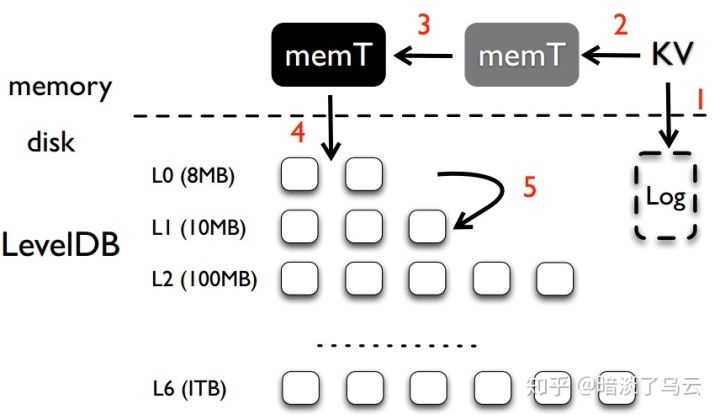
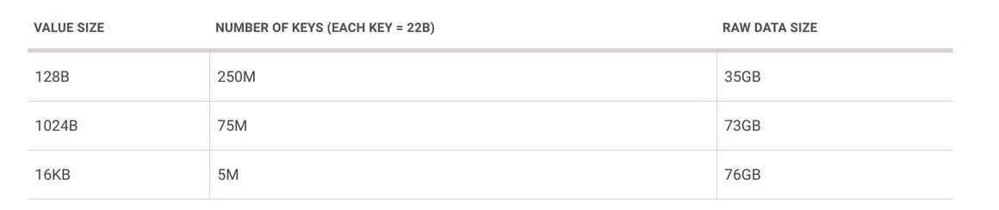
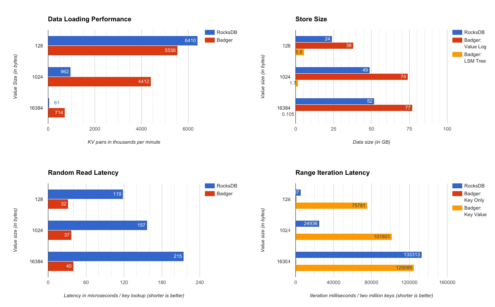

## badger

BadgerDB 一个纯 GO 语言实现的嵌入式、持久化、高性能的 KV 存储构件。

## 为什么不使用  RocksDB

Dgraph 是使用 Go 语言来开发，而 RocksDB 使用 C 语言开发，在使用过程中，需要以 cgo 作为桥梁进行联调。

- 在实际联调过程中，GO 的 profiler 性能分析工具无法追溯到 CGO 的调用。
- CGO 还会引发内存泄露
- 接入 dgraph 和 RocksDB 的 cgo-level 难以维护

团队总结出以上 CGO 问题，为了避免跨语言的引擎调用，决定自研开发纯 GO 的 KV 存储构件。

## 依赖技术

- LSM（Log-Structured Merge）

- SSD

HDD 随机 I/O 要比顺序 I/O 慢 100 倍
SSD 随机 I/O 与顺序 I/O 差异没那么大，以 Samsung 960 Pro 磁盘为例，每秒可达到 440K 次随机读取 4KB 文件块。

## 核心设计内容

同样参照 LevelDB 的设计，仅提供原子方法，更多方法请参考 https://godoc.org/github.com/dgraph-io/badger

 - Get
 - Set
 - Delete
 - Iterate
 - CompareAndSet
 - CompareAndDelete
 
Badger 不是定位与数据库，所以更多的事务、版本、镜像由基于 Badger 构建的数据库来实现。
 
不同于 RocksDB 使用 KEY-VALUE 结对存储，Badger 将 KEY 和 VALUE 分开存储，KEY 存在在 LSM-Tree 数据结构，而 VALUE 存储在 WAL（write-ahead log）的文件中，称为 value-log。相对内容，KEY 本身比较小，构件出来的 LSM—Tree 也比较小，当读取 value 时，则从 SSD 中的 value-log 提取，更大程度地发挥了 SSD 随机读取的能力。

### 指导原则

- 纯 GO 语言编写
- 使用更高效 KV 存储设计方案，来自最新科研论文
- 简答、易于理解
- 以作为 SSD 核心组件

### KV 分离方案

在 LSM—Tree 的设计，保持单个 LSM 有序是为了更为高效地命中提取或者范围索取。当有了排序功能，在进行 KEYS 检索时，在每一层至多打开一个文件。

有序需要依赖 LSM 压实进程（CompactionProcess），在压实的时候，LSM 需要读取多个文件到内层，进行合并排序，写回磁盘，LSM 主要性能问题也在这里。

文件都是有固定大小，当数据量大时，将会有触发更多的压实进程。而 Badger 在 LSM—Tree 上仅村存放了 key 和 value 的指针，假设 key=16Bytes, value 指针=16Bytes，则 64MB 文件可以存放 200 万个 KV 对。

### 随着数据量的增长，读写放大分析

- 写开销放大

由于 value 独立存放，随着 value 增长，相对 RockSDB 层级更少，压实次数更少，写效率更为稳定

- 读效率放大

相对于传统的 LSM-Tree，Badger 的层级更少，在检索时，平均需要遍历的层数和文件数更少，并且整体 LSM—Tree 占用空间小，可以直接加载内存中，检索性能更高。

## 测试数据

### 准备数据

### 从四个角度进行观察

- 批量写入性能（Data loading performance）
- 存储量（Output size）
- 随机 KEY 读取延迟（Random key lookup performance）
- 顺序读取性能（Sorted range iteration performance）

### 结论

- 更大 value 特征（1KB-16KB），Badger 写入效率由于 RocksDB
- 更小的 LSM，更大的 value-log
- 随机 KEY 读取延迟，Badger 明显优于 RocksDB【作者最引以为豪的点】
- 顺序范围读取，RocksDB 明显性能更好

## 未来期许

- 提高顺序读取性能（Speed of range iteration）
- 提高压实性能（Speed of compactions）
- 可以考虑对 LSM-Tree 进行压缩
- 使用 B+Tree 方案（B+ tree approach）

## 思考 & 质疑

- RocksDB 作为业界顶级的 KV 存储底层构件，已被校验无数次
- Badger 最适合的场景是 key 小 value 大，而且基本就一次写入，较少更新的场景 
- 大部分情况下，value不是较大数值，Badger 在写入和顺序读取性能不及 RocksDB
- KV 分离，意味着 KEY—VALUE 需要分开考虑 GC 问题，一致性的保障机制需要质疑

## 资料

https://dgraph.io/blog/post/badger/
https://www.usenix.org/system/files/conference/fast16/fast16-papers-lu.pdf
https://www.zhihu.com/question/59895275

