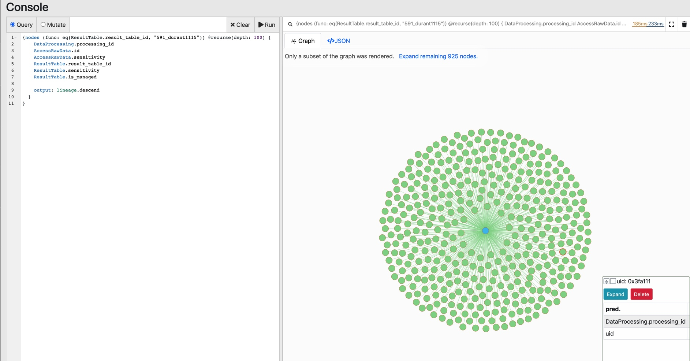
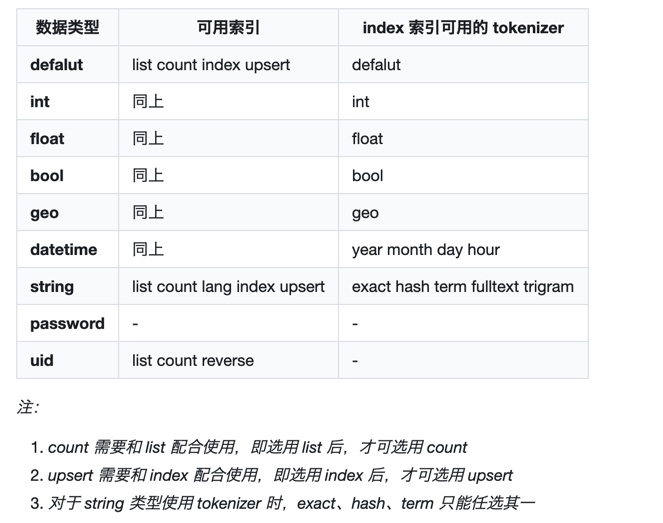
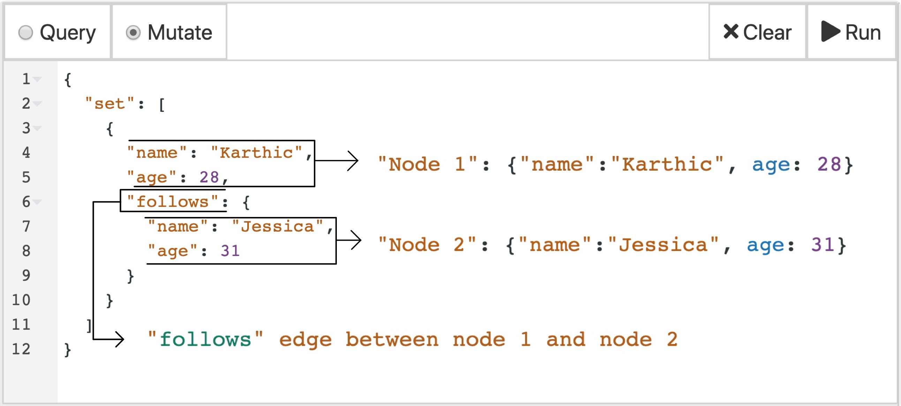

> Dgraph is an open-source, transactional, distributed, native Graph Database. 

Dgraph 是开源的，支持事务，支持分布式，原生的图数据库。Dgraph的目标是提供谷歌生产水平的规模和吞吐量，具有足够低的延迟，可以提供超过数TB的结构化数据的实时用户查询。DGraph组件支持GraphQL的查询语法，以及响应JSON和协议缓冲区超过GRPC和HTTP。

## 1. 基本架构


ratel：提供用户界面来执行数据查询，数据修改及元数据管理。
alpha：用于管理数据（谓词和索引），外部用户主要都是和 alpha 进行数据交互。
group：多个 alpha 组成一个 group（即图中同色 alpha），group 中的多个 alpha 通过 raft 协议保证数据一致性。
zero：用于管理集群，并在 group 之间按照指定频率去均衡数据。


- 本地单机 DOCKER 部署测试环境

```
docker pull dgraph/dgraph

mkdir -p ~/dgraph
docker run -it -p 5080:5080 -p 6080:6080 -p 8080:8080 -p 9080:9080 -p 8000:8000 -v ~/dgraph:/dgraph --name dgraph dgraph/dgraph dgraph zero

docker exec -it dgraph dgraph alpha --lru_mb 2048 --zero localhost:5080
docker exec -it dgraph dgraph-ratel
```


## 2. 基本概念




- 节点
    - node
    - object
    - entity

- 谓词
    - Predicates
    - edges
    - relationship


## 3. 基本语法

### 3.1 SCHEMA 定义

```
# Define Types

type Person {
    name
    boss_of
    works_for
}

type Company {
    name
    industry
    work_here #this is an alias
}

# Define Directives and index

industry: string @index(term) .
boss_of: [uid] .
name: string @index(exact, term) .
works_for: [uid] .
work_here: [uid] .
```

### 3.2 数据类型

Dgraph 中所有属性都被称为 predicate，即谓词；每个 predicate 都有确定的数据类型。


### 3.3 索引和分词器
Dgraph 基于每种数据类型，提供了不同的索引及其分词器。目前，建立索引及分词器的意义在于，建立以后可以使用相应的系统函数




### 3.4 查询方式

#### 3.4.1 插入数据

- JSON 配置方式




- RDF 配置方式

```
{
  set {
    _:karthic <name> "Karthic" .
    _:karthic <age> "28" .

    _:jessica <name> "Jessica" .
    _:jessica <age> "31" .

    _:jessica <follows> _:karthic .
  }
}
```

不存在 uid 写法： `_:company1  <_:uid43>  `
存在 uid 写法 ：  `<0x4e030f>`


#### 3.4.2 查询数据


## 4. 语法例子

### 4.1 查询 schema
```
# 指定查询
schema(pred: [name, age, friend, owns_pet]) {
  type
  index
}

# 查询全部
schema {}
```

### 4.2 多语言查询

@ko:ru:. 适配 ko、ru 和其他语言

```
{
  language_support(func: allofterms(name@hi, "अमित")) {
    name@bn:hi:en
    age
    friend {
      name@ko:ru:.
      age
    }
  }
}
```
### 4.3 正常查询数据，通过边追溯

```
{
  michael_friends_and_pet(func: eq(name, "Michael")) {
    name
    age
    friend {
      name@.
      friend {
        name@.
      }
      owns_pet {
        name@.
      }
    }
    owns_pet {
      name
    }
  }
}
```

### 4.4 子节点过滤
```
{
  michaels_friends_filter(func: allofterms(name, "Michael")) {
    name
    age
    friend @filter(ge(age, 27)) {
      name@.
      age
    }
  }
}
```

### 4.5 排序
```
{
  michael_friends_sorted(func: allofterms(name, "Michael")) {
    name
    age
    friend (orderasc: age) {
      name@.
      age
    }
  }
}
```

### 4.6 分页
```
{
  michael_friends_first(func: allofterms(name, "Michael")) {
    name
    age
    friend (orderasc: name@., offset: 1, first: 2) {
      name@.
    }
  }
}
```

### 4.7 字段是否存在，为统计指标取别名

```
{
  have_friends(func: has(friend)) {
    name@.
    age
    number_of_friends : count(friend)
  }
}
```

### 4.8 移除不存在匹配字段的节点
```
{
  michael_friends_with_pets(func: allofterms(name, "Michael")) @cascade {
    name
    age
    friend {
      name@.
      owns_pet
    }
  }
}
```

### 4.9 查询节点所有边

```
{
  company(func: allofterms(name, "CompanyABC")) {
    _predicate_
  }
}
```

### 4.10 自动展开所有数值边

样例为两级展开

```
{
  expand(func: allofterms(name, "Michael")) {
    expand(_all_) {
      expand(_all_) 
    }
  }
}

```

### 4.11 使用数值变量，指定节点展开的边（queried edge）

```
{
  var(func:allofterms(name@en, "Cherie Nowlan")) {
    pred as _predicate_
  }

  q(func:allofterms(name@en, "Cherie")) {
    expand(val(pred)) { expand(_all_) }
  }
}
```


### 4.12 嵌套查询，变量复用【较为复杂，自行理解】


主要用于过滤和重新组织返回结果

```
{
  coactors(func:allofterms(name@en, "Jane Campion")) @cascade {
    JC_films as director.film {      # JC_films = all Jane Campion's films
      starting_movie: name@en
      starring {
        JC_actors as performance.actor {      # JC_actors = all actors in all JC films
          actor : name@en
          actor.film {
            performance.film @filter(not uid(JC_films)) {
              film_together : name@en
              starring {
                # find a coactor who has been in some JC film
                performance.actor @filter(uid(JC_actors)) {
                  coactor_name: name@en
                }
              }
            }
          }
        }
      }
    }
  }
}
```

### 4.13 处于两次查询的交集【Good】

共同出演过 Peter Jackson 与 Martin Scorsese 导演的电影的明星有哪些，并且他们还出演过什么其他不在这两位导演名下的电影。


```
{
  var(func: allofterms(name@en, "Peter Jackson")) {
    F_PJ as director.film {
      starring{
        A_PJ as performance.actor
      }
    }
  }

   var(func: allofterms(name@en, "Martin Scorsese")) {
    F_MS as director.film {
      starring{
        A_MS as performance.actor
      }
    }
  }

  actors(func: uid(A_PJ)) @filter(uid(A_MS)) @cascade {
    actor: name@en
    actor.film {
      performance.film @filter (uid(F_PJ, F_MS)) {
        name@en
      }
    }
  }
}
```


### 4.14 获取最新记录的前几条【Good】

关键语法： since、first

获取最近发布过电影的前十位导演，以及他们的作品和发布时间

```
{ 
  ·# Get all directors
  var(func: has(director.film)) @cascade {
    director.film {
      date as initial_release_date
    }

    # Store maxDate as a variable
    maxDate as max(val(date))
    daysSince as math(since(maxDate)/(24*60*60))
  }

  # Order by maxDate
  me(func: uid(maxDate), orderdesc: val(maxDate), first: 10) {
    name@en
    days : val(daysSince)

    # For each director, sort by release date and get latest movie.
    director.film(orderdesc: initial_release_date, first: 1) {
      name@en
      initial_release_date
    }
  }
}
```

### 4.15 聚合计算

聚合计算后必须把结果寄存在数值变量中， 然后再使用另一查询来显示

```
{
  var(func:allofterms(name@en, "Steven Spielberg")) {
    director.film @groupby(genre) {
      a as count(uid)
    }
  }

  byGenre(func: uid(a), orderdesc: val(a)) {
    name@en
    num_movies : val(a)
  }
}

```

### 4.16 递归查询

当返回内容多大，会导致查询失败，为了避免递归爆炸，可以通过以下方式进行缓解

1. 最好设置下深度
2. 尽量避免设置 loop:true
3. 多设置过滤条件，限制返回数量

```
{
    me(func: gt(count(~genre), 30000), first: 1) @recurse(depth: 5, loop: true) {
        name@en
        ~genre (first:10) @filter(gt(count(starring), 2))
        starring (first: 2)
        performance.actor
    }
}
```


## 5. 文档字典整理

### 5.1 函数整理

```
allOfTerms(edge_name, "term1 ... termN"): matches nodes with an outgoing string edge edge_name where the string contains all listed terms.

anyOfTerms(edge_name, "term1 ... termN"): As with allOfTerms, but matches at least one term.

eq(edge_name, value): equal to
ge(edge_name, value): greater than or equal to
le(edge_name, value): less than or equal to
gt(edge_name, value): greater than
lt(edge_name, value): less than

has(edge_name): 是否存在指定输出边
```


### 5.2 运算符

- AND 
- OR 
- NOT
- orderasc 
- orderdesc


### 5.3 数值变量可以进行的操作

一般可进行的操作有
1. 聚合计算，比如 min、max、avg、sum
3. 数学运算 + - * /


## 6. 数据平台的使用方式


### 6.1 按照结果表定义 dgraph 结构

```
<AccessRawData.bk_app_code>: string .
<AccessRawData.bk_biz>: uid @count @reverse .
<AccessRawData.bk_biz_id>: int @index(int) @count .
<AccessRawData.data_category>: string .
<AccessRawData.data_encoding>: string .
<AccessRawData.data_scenario>: string .
<AccessRawData.data_source>: string .
<AccessRawData.description>: string @index(fulltext,trigram) @count .
<AccessRawData.id>: int @index(int) @count .
<AccessRawData.maintainer>: string .
<AccessRawData.permission>: string .
<AccessRawData.raw_data_alias>: string @index(fulltext,trigram) @count .
<AccessRawData.raw_data_name>: string @index(exact,trigram) @count .
<AccessRawData.sensitivity>: string .
<AccessRawData.storage_channel>: uid @count @reverse .
<AccessRawData.storage_channel_id>: int .
<AccessRawData.storage_partitions>: int .
<AccessRawData.typed>: string .

<active>: bool @index(bool) @count .
<created_at>: dateTime @index(hour) @count .
<created_by>: string @index(exact,trigram) @count .
<lineage.descend>: uid @count @reverse .
<updated_at>: dateTime @index(hour) @count .
<updated_by>: string @index(exact,trigram) @count .
```

### 6.2 基于血缘关系，检索某一结果表的族谱结构，以及附加信息


## 7. 使用场景

- 社交网络 [Social Networks] 
- 关联数据 [Interconnected data, like SQL tables requiring joins] 
- 高级检索 [Advanced search] 
- 推荐引擎 [Recommendation engines] 
- 模式识别 [Pattern detection] 
- 互联网、物联网、交通网 [Networks, like computers, roads, and telecommunications]
- 业务流程 [Processes, like business and biological processes]
- 因果关系 [Events and the causality or other links between them]
- 公司和市场结构 [Structures of firms or markets]


## 8. 相关链接

- [DGraph Tour] https://tour.dgraph.io/intro/1/
- [DGraph 简单介绍] https://www.6aiq.com/article/1586914360530
- [Raft 协议详解] https://zhuanlan.zhihu.com/p/27207160
- [RDF 1.1 Concepts and Abstract Syntax] https://www.w3.org/TR/rdf11-concepts/
- [graphql 语法规则] https://graphql.cn/

