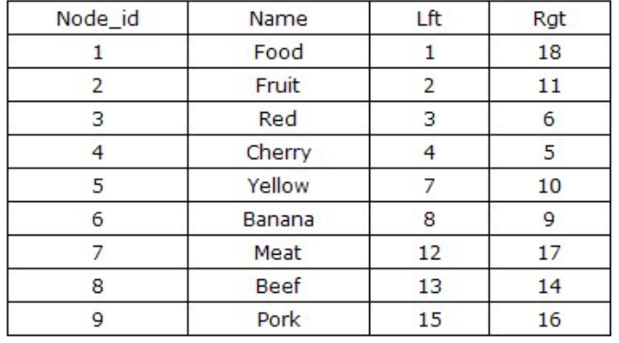
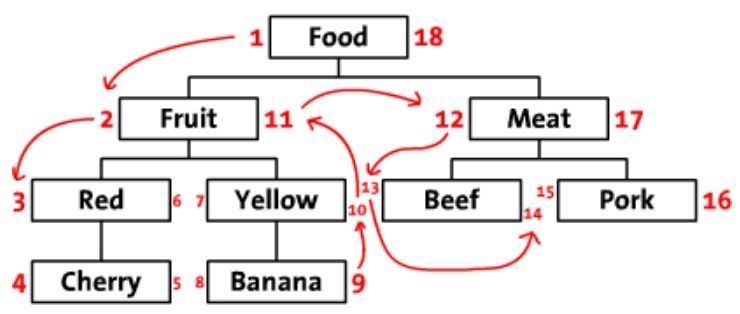
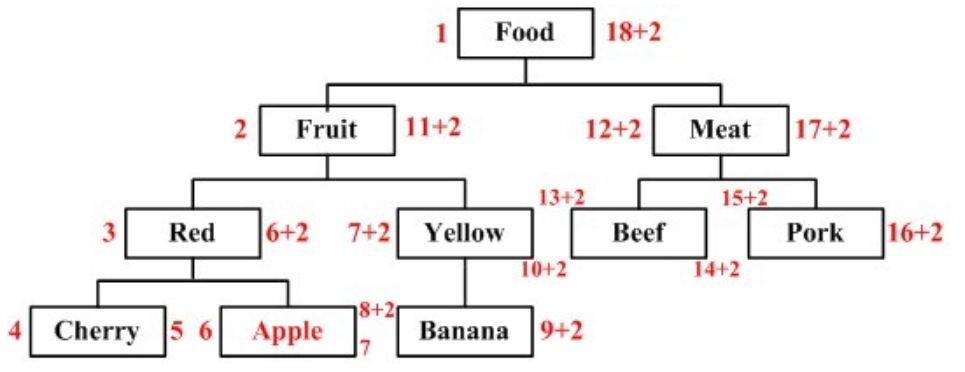
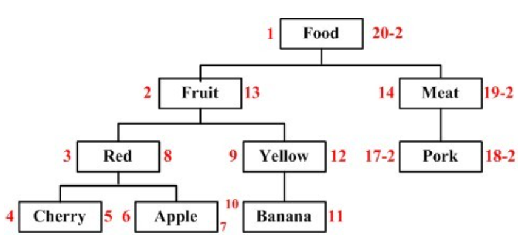
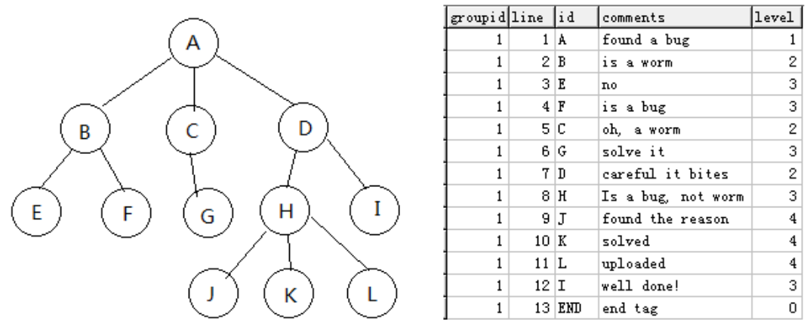

### MYSQL 存储树形结构

1. **关系驱动 - 频繁递归**

2. **左右值编码 - 按树的前序遍历**

   

   - 查找 Fruit 的子节点: `select * from Tree where Lft between 2 and 11 order by Lft asc`

   - 计算 Fruit 子节点的个数 `(Rgt-Lft-1)/2`

   - 计算 Fruit 节点的层数 `selectcount(*) from Tree where Lft<=2 and Rgt>=11` (可以用函数生成卸载表里)

   - 计算 Fruit 节点族谱路径 `select * from Tree where Lft<2 and Rgt>11`

   - 新增节点： 从新增节点往后的所有编码都要 `+2`

     

   - 删除节点：删除 Beef -> 大与 16 的编码都要 `-(Rgt-Lgt+1)`, `Lgt,Rgt` 为被删除节点的左右编码值

     

   - 删除节点：删除 Beef -> 大与 16 的编码都要 `-(Rgt-Lgt+1)`, `Lgt,Rgt` 为被删除节点的左右编码值

     

   - 总结：
     - 优点：取消递归，查询效率较高，查询条件基于整型数字

     - 缺点：

       1. CUD涉及多节点数据的改动，开销较大（可能存在大量节点权值更新）
   
2. ！！！并发CUD较大时可能因为左右编码值修改不及时导致索引错误
       
       因为是消除递归，所以CUD操作会麻烦很多
   
   - 优化：
     - 节点两边的权值很像**线段树**，能不能按照线段树单点更新的操作去维护节点两边的权值，从而来避免步长空间使用完毕导致大量节点权值的更新问题 （懒更新 => 更新的时候打标签，等到**查询**的时候再真正更新）
   
3. **海底捞** 

   
   - 查找C的子节点 `select * from Tree where line>=5 and line<(select min(line) from tree where line >5 and line <=2)` (先找以C开始的所有前序遍历节点G,D,H,J,K,L,I，再排除D及其子节点)
   - 删除H节点：先查询H节点及其子节点，拿到H,J,K,L的行号，直接删除行号。虽然这样会造成跳号，但不影响使用（行号 => 相对大小）
   - 在J,K之间插入新节点：`update Tree set line = line+1 where line >= 10` `inser into Tree(line,id,level) values (10,'T',4)`
   - 前序+层次能确定一棵树？ => 只需要关心孩子节点和夫节点的关系就行，不需要细化到兄弟层面

