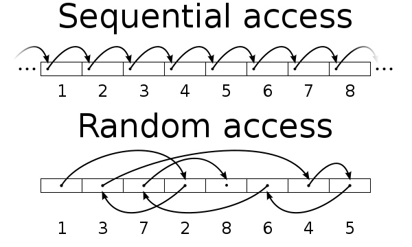
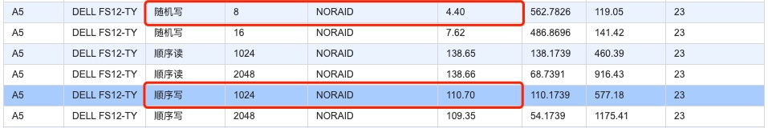
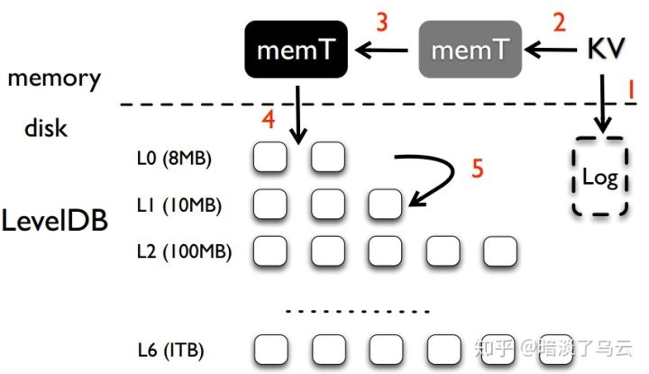

# LSM存储引擎
> 本文不涉及具体LSM树算法，而是尝试从存储引擎的角度，从无到有来演化出LSM，方便更好理解LSM是什么及产生在什么样的背景下

## 最简单的数据库

最简单的数据库，通过日志追加实现

```bash
#!/bin/bash
db_set () {
    echo "$1,$2" >> database
}

db_get() {
    grep "^$1," database | sed -e "s/^$1,//" | tail -n 1
}
```

- 基本操作：
    + 添加：append
    + 修改：append
    + 删除：append 一个特殊标记
    + 查询：查找最后一次出现的key

- 优点：写入性能非常好，发挥了磁盘顺序写的优点





- 缺点：
    + 占用的磁盘空间很大，需要定期合并
    + 查询时间复杂度 `o(n)` ，可以用布隆过滤器快速排出没有的情况

## 优化：引入hash索引
+ 优点：速度快
+ 缺点：
    - 不能按key顺序读
    - 机器重启了数据丢失
    - 超过内存容量之后，变成了磁盘随机读

## 优化：排序数据表 SSTable（LSM核心数据结构）
将写入到磁盘的数据按key排序

### 优点：
+ 合并段非常高效，基于文件大于可用内存
+ 不要保存所有key的索引

### 构建和维护SSTable——LSM树算法
- 写入时，添加到内存中的平衡树（比如红黑树），称为内存表
- 内存表大小达到阈值时，以SSTable结构写入磁盘，新的写请求写入一个新的内存表
- 查询时，先从内存表中查询，在SSTable文件中查询
- 后台运行多个SSTable合并

问题：当进程崩溃时内存表会丢失
解决办法：对写入请求记录到日志中

### LSM树
基于合并和压缩排序文件原理的存储引擎通常称为LSM存储引擎



基本 write 流程
1）数据首先会被写到 log，保证持久性；
2）然后写入 mutable memtable 中，返回；
3）当 mutable 内存到达一定大小之后就会变成 immutable memtable；
4）当到达一定的条件后，后台的 Compaction 线程会把 immutable memtable 刷到盘中 Level 0 中 sstable；
5）当 level i 到一定条件后（某个 level 中的数据量或者 sstable 文件数据等）就会和 level i+1 中的 sstable 进行 Compaction，合并成 level i+1 的 sst 文件。

## 参考资料
- [Log Structured Merge Trees(LSM) 原理](https://www.open-open.com/lib/view/open1424916275249.html)
- [LevelDB深入浅出之整体架构](https://zhuanlan.zhihu.com/p/67833030)
- [LevelDB 之 Compaction](https://zhuanlan.zhihu.com/p/46718964)

