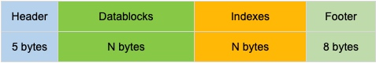
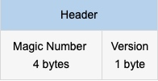
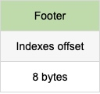
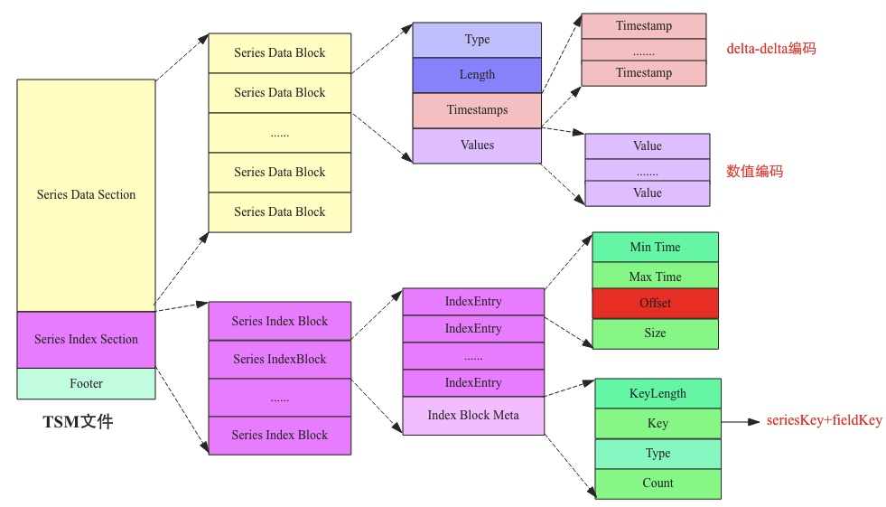

# tsm 存储引擎-数据写入

## 接口
### engine write接口
- 输入： `INSERT cpu,host=serverB,region=us_west value=0.74,value2=0.75`
- 输出

```bash
[]models.point *{
		time: time.Time {wall: 675805000, ext: 63731786919, loc: *time.Location nil,},
		key: "cpu,host=serverB,region=us_west",
		fields: "value=0.74,value2=0.75",
		ts: []uint8 len: 0, cap: 457, [],
		data: []uint8 len: 0, cap: 0, nil,
		cachedFields: map[string]interface {} [
			"value": 0.74,
			"value2": 0.75,
		],
		cachedName: "cpu",
}
```

### cache/wal write接口
- 输入： `INSERT cpu,host=serverB,region=us_west value=0.74,value2=0.75`
- 输出 ：
    + key: "cpu,host=serverB,region=us_west#!~#value" value: [{unixnano: 1596190540272481000, value: 0.74}]
    + key: "cpu,host=serverB,region=us_west#!~#value2" value: [{unixnano: 1596190540272481000, value: 0.75}]

### cache
- 已map的方式组织所有kev/value，后添加进来的key/value按key进行合并

```json
{
    "cpu,host=serverB,region=us_west#!~#value": [
        {"unixnano": 1596190540272481000, "value": 0.74}, 
        {"unixnano": 1596190540272482000, "value": 0.84}],
    "cpu,host=serverB,region=us_west#!~#value2": [
        {"unixnano": 1596190540272481000, "value": 0.75}, 
        {"unixnano": 1596190540272482000, "value": 0.85}]
}
```

- 快照操作：将当前cache.store(前面的json结构)内容拷贝到snapshot对象里面，并清空cache.store

### wal
- 将前面的json数据压缩后写入文件，并执行`sync()`
- 用途：故障恢复


## 磁盘文件格式
	
	








## 合并
在了解如何查找数据之前，先看下数据如何落盘，如何合并，最终的查找需要在这些文件中实现

### 内存数据什么时候落盘
触发任何一个条件就落盘，每 1s 检查一次

- cache-snapshot-memory-size = "25m"
- WAL最后一次写入时间 >= compact-full-write-cold-duration = "4h"

### compactCache
- 关闭当前写入的WAL文件，新建一个WAL文件
- 对内存cache进行快照操作
- 对快照数据排序和去中（同一个key下的数据）
- 将快照数据写入tsm文件，并删除已经关闭的WAL文件
- 删除内存快照

### compactTSMLevel 有1，2，3三个level
- 获取要压缩的文件列表
    + 获取所有tsm文件(tsm文件名格式是：`{{generation}}-{{sequence}}`)
    + 将tsm文件按照 generation 聚合
    + 获取当前层和上一层文件列表，取前几个（一次太多文件会触发备份？）
- 根据上一步的文件列表获取一个iter，每次返回这些文件中最小的一个key
- 迭代上一步的iter，写入新的tsm文件，文件大小达到阈值时新建一个文件
- 删除旧的文件列表


### compactTSMFull
全量合并


