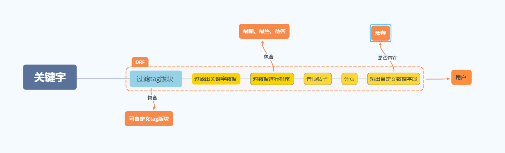

##### 由于当前社区用户活跃度较少，用户活跃度在每年早鸟活动中才有较大提升，所以对于社区帖子搜索方案使用了较为简单的(drf+django_cache)的方案。

1. 搜索方式：
- 自定义搜索，用户自由搜索
- 根据产品给出的高频关键字固定在页面头部，做为某个标签分类，方便用户搜寻  

2. 排序
- 最新 （根据发贴时间）
- 最热 （用户对帖子回复量排序）
- 待答 （零用户回复的帖子）

3. 分页
- 使用DRF分页功能 （默认10条数据）

##### 呈现在用户面前的最终数据为：

